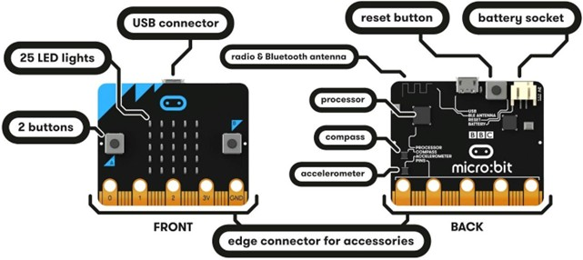
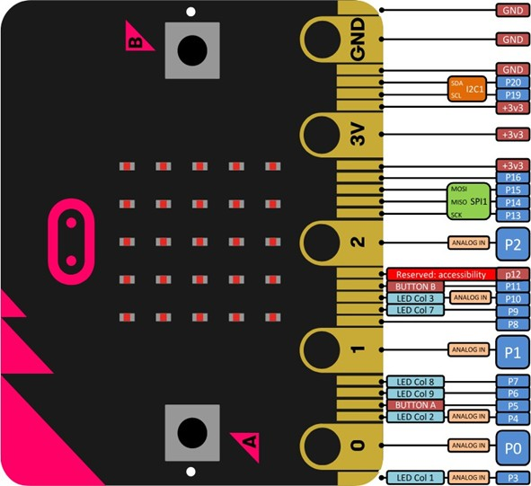
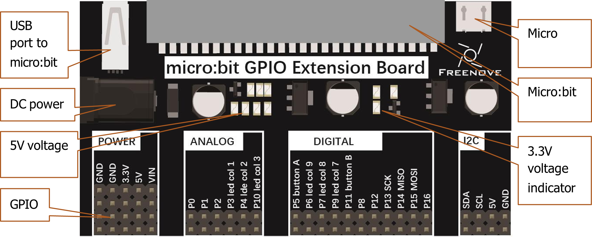
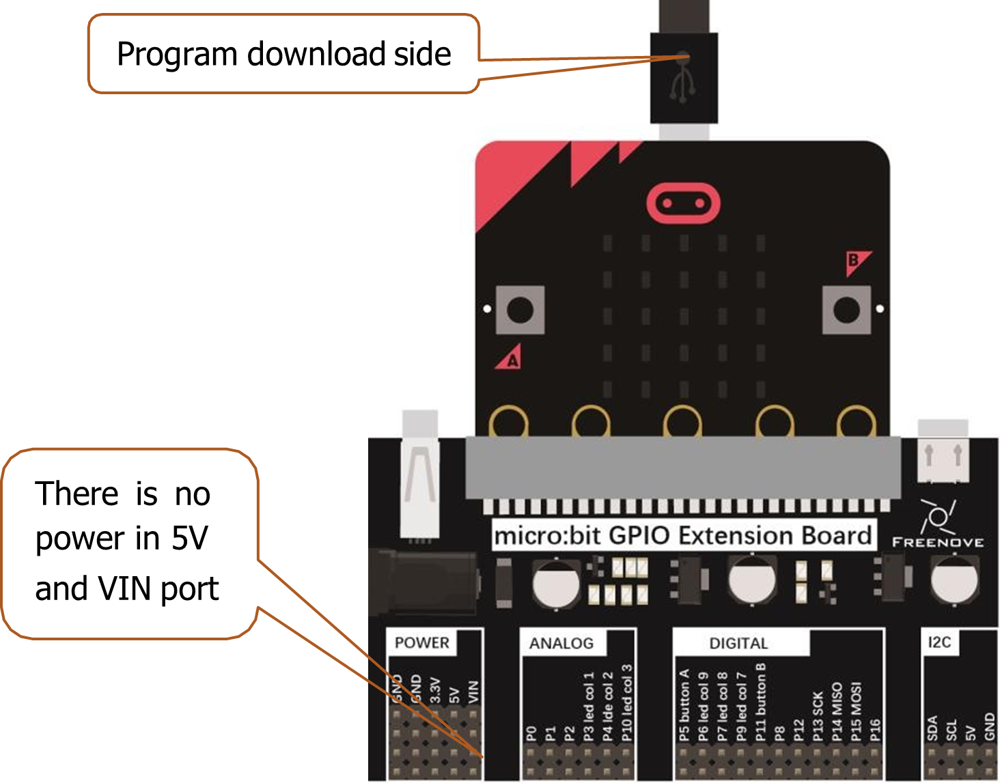
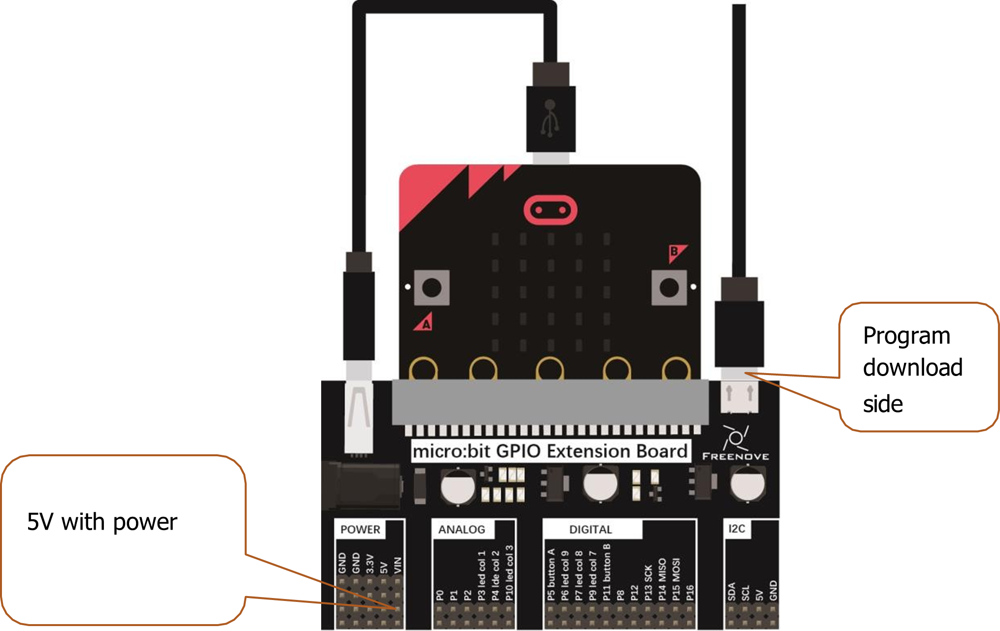
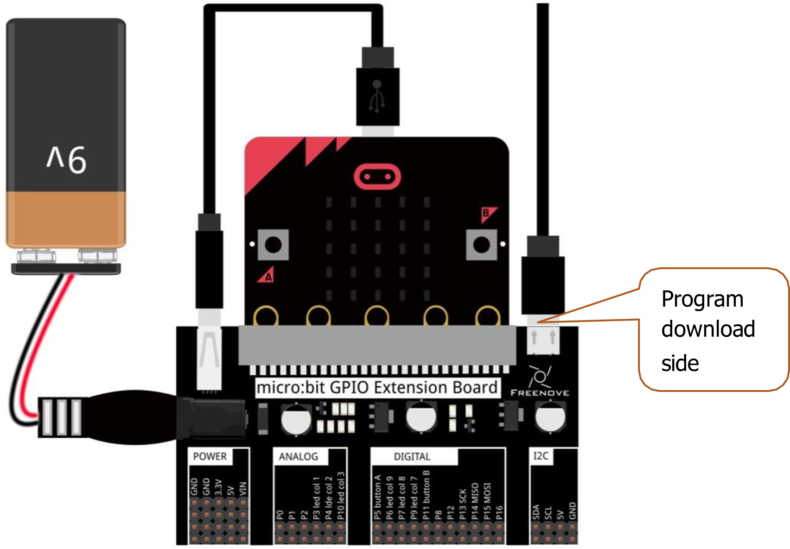

# Conocer el Hardware
Empecemos por el principio, el hardware. A continuación podemos ver una representación de la placa con la que vamos a travajar en este manual.

    

La micro:bit tiene las siguientes características hardware:
- 25 LED programables individuales
- 2 botones programables
- Pines de conexión física
- Sensores de luz y temperatura
- Sensores de movimiento (acelerómetro y brújula)
- Comunicación inalámbrica, vía radio y Bluetooth
- Interfaz USB

Para más información sobre la micro:bit, podenis visitar la página: [https://microbit.org/guide/features/](https://microbit.org/guide/features/).

No es necesario que los principiantes dominen esta sección, pero sí es necesario tener una idea general. Sin embargo, si queremos ser desarrolladores, la información sobre el hardware resultará muy útil. Encontraremos información detallada sobre el hardware de la micro:bit [aquí](https://tech.microbit.org/hardware/).

## GPIO
La GPIO, es decir, los pines de entrada/salida de uso general, son un componentev importante de la micro:bit para conectar dispositivos externos. Todos los sensores y dispositivos de la placa se comunican entre sí a través de los GPIO del micro:bit. A continuación se muestra el diagrama de numeración y funciones:

    

## GPIO - Placa de extensión
La placa de extensión es un accesorio que permite conectar la micro:bit a otros dispositivos electrónicos conectado a la placa micro:bit a través del socket correspondiente. Esta placa proporciona una forma más fácil de acceder a los pines GPIO de la micro:bit, lo que facilita la conexión de sensores, actuadores y otros componentes electrónicos. A continuación se muestra un ejemplo de una placa de extensión:

    

En esta extensión se han añadido puertos de entrada - salida adicionales con voltajes de 5V y VIN(9V) para suplir los requerimientos de algunos dispositivos.

### Cómo usar la extensión
Si no es necesario utilizar los voltajes extendidos podemos hacer uso de la placa de la siguiente manera:

    

Si los periféricos necesitan 5V, pero no mucha potencia, la siguiente imagen muestra cómo hacerlo:

    

Por último, si las necesidades son elevadas, el diagrama siguiente muestra la configuración adecuada:

    

