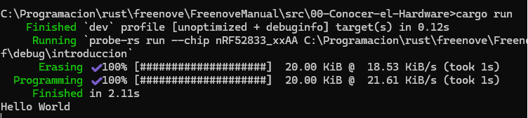

# Programación de la Micro::bit 2
Con este manual vamos a aprender a programar la Micro::bit 2, un microcontrolador diseñado para la educación y la experimentación en electrónica y programación. La Micro::bit 2 cuenta con una variedad de sensores, botones, una pantalla LED y conectividad Bluetooth, lo que la hace ideal para proyectos interactivos. Utilizaremos como base el leguaje Rust, que es un lenguaje de programación moderno y seguro, para crear programas que interactúen con los componentes de la Micro::bit 2.

## Referencias
Antes de nada unas pocas referencias:
- [Documentación oficial de la Micro::bit 2](https://microbit.org/)
- [Documentación de Rust](https://www.rust-lang.org/learn)
- [micro::bit v2 Embedded Discovery Book (castellano)](https://github.com/csanjuanp-ies/discovery-mb2)
- [Rust Embedded Book](https://docs.rust-embedded.org/book/)

## Instalación del entorno de desarrollo
Para programar la Micro::bit 2 con Rust, necesitamos configurar nuestro entorno de desarrollo. Antes de pasar a la instación real, enumeraremos los requisitos que he probado en este manual:
- Rust 1.79.0 o una toolchain más reciente.
- `gdb-multiarch`. Herramienta de depuración. La versión más antigua que hemos probado es la 10.2, pero es probable que otras versiones también funcionen. Si la distribución/plataforma no tiene `gdb-multiarch` disponible, podemos usar `arm-none-eabi-gdb` para depurar. Además, algunos binarios de `gdb` están construidos con capacidades multiplataforma: se puede encontrar más información sobre esto en el capítulo de depuración de este libro.
- [`cargo-binutils`]. Versión 0.3.6 o posterior.
  [`cargo-binutils`]: https://github.com/rust-embedded/cargo-binutils
- [`probe-rs-tools`]. Versión 0.24.0 o más reciente.
  [`probe-rs-tools`]: https://probe.rs/docs/overview/about-probe-rs/
- `minicom` en Linux y macOS. Se ha probado la versión: 2.7.1. Esperamos que versiones posteriores también funcionen.
- `PuTTY` en Windows.

### Instalación de Rust
Para instalar Rust, podemos utilizar `rustup`, que es la herramienta oficial para gestionar las versiones de Rust. Si no tenemos `rustup` instalado, seguiremos las instrucciones en la [página oficial de Rust](https://www.rust-lang.org/tools/install).

>**Instruciones de la página**: Para empezar a usar Rust, descarga el instalador, ejecuta el programa y sigue las instrucciones que aparecen en pantalla. Es posible que tengas que instalar las herramientas de compilación de Visual Studio C++ cuando se solicite. Si no utilizas Windows, consulta "Otros métodos de instalación".

``` console
$ rustc -V
rustc 1.94.0 (4a4ef493e 2026-03-02)
```

Una vez instalado `rustup`, tenemos que instalar la toolchain de Rust con el comando:
``` console
$ rustup target add thumbv7em-none-eabihf
```

Solo hay que hacerlo una vez; `rustup` actualizará automáticamente la cadena de compilación si se lo pedimos. Explicaremos más adelante por qué es necesario instalar esta toolchain específica.

### Instalación bajo Windows
La mayoría de ordenadores educativos utilizan Windows, por lo que vamos a detallar los pasos para instalar Rust en este sistema operativo. Si estamos usando otra plataforma recomiendo leer el libro de micro::bit v2 Embedded Discovery Book.

#### gdb-multiarch (`arm-none-eabi-gdb`)
> Hemos descargado e instalado el siguiente archivo de la página oficial de Arm:
> [Aquí](https://developer.arm.com/-/media/Files/downloads/gnu/15.2.rel1/binrel/arm-gnu-toolchain-15.2.rel1-mingw-w64-x86_64-arm-none-eabi.msi)

Arm proporciona ejecutables (`.exe`) para Windows. Se pueden encontrar en [gcc](https://developer.arm.com/downloads/-/arm-gnu-toolchain-downloads), solo hay que seguir las instrucciones.
Justo antes de que finalice el proceso de instalación, hay que marcar/seleccionar la opción "Añadir ruta a la variable de entorno". Si no aparece dicha opción se tendrá que hacer desde el diálogo del sistema y añadir la siguiente ruta para la instalación por defecto:

> C:\Program Files\Arm\GNU Toolchain mingw-w64-x86_64-arm-none-eabi\bin

A continuación, comprobaremos que las herramientas se encuentran en el `%PATH%`:

``` console
$ arm-none-eabi-gcc -v
(..)
gcc version 15.2.1 20251203 (Arm GNU Toolchain 15.2.Rel1 (Build arm-15.86))
```

#### cargo-binutils
``` console
$ rustup component add llvm-tools
$ cargo install cargo-binutils --vers '^0.4'
$ cargo size --version
cargo-size 0.4.0
```

#### probe-rs-tools
**NOTA** Si existen en el sistema versiones anteriores de `probe-run`, `probe-rs` o `cargo-embed` instaladas, hay que eliminarlas antes de seguir adelante, ya que podrían causar problemas. En particular, `probe-run` ya no existe oficialmente. Hay que eliminarlas si es necesario:

```console
$ cargo uninstall cargo-embed
$ cargo uninstall probe-run
$ cargo uninstall probe-rs
$ cargo uninstall probe-rs-cli
```

Para instalar `probe-rs-tools`, hay que seguir las instrucciones de la página oficial en https://probe.rs.
En mi caso la instalación mediante cargo no me ha dado ningún tipo de problema.

```console
$ cargo install probe-rs-tools

Finished `release` profile [optimized] target(s) in 3m 34s
Installing C:\Users\arcipreste\.cargo\bin\cargo-embed.exe
Installing C:\Users\arcipreste\.cargo\bin\cargo-flash.exe
Installing C:\Users\arcipreste\.cargo\bin\probe-rs.exe
Installed package `probe-rs-tools v0.31.0` (executables `cargo-embed.exe`, `cargo-flash.exe`, `probe-rs.exe`)

C:\Users\...>probe-rs
The probe-rs CLI
```

Instalar la herramienta `probe-rs-tools` configurará en nuestro ordenador diversas herramientas muy útiles, incluyendo `probe-rs` y `cargo-embed` (que normalmente se ejecutan como un comando de Cargo). Debemos comprobar que todo funciona correctamente antes de pasar a la siguiene sección.

```
$ cargo embed --version
cargo embed 0.31.0 (git commit: crates.io)
```

#### PuTTY
Se puede descargar `putty.exe` desde [aquí](http://www.chiark.greenend.org.uk/~sgtatham/putty/download.html) y añadirlo al `%PATH%`.

## Primer ejemplo: "Hola, mundo"
Vamos a crear nuestro primer programa para la Micro::bit 2, que mostrará el mensaje "Hola, mundo" en el terminal. Para ello, seguiremos los siguientes pasos:
- Conectamos la placa a un puerto USB de nuestro ordenador. Comprobamos que se abre una ventana con el contenido de la MB2.
- Abrimos un terminal y nos situamos en el directorio del capítulo inicial:
```
$ cd src/00-Conocer-el-Hardware/
```
- Ejecutamos el siguiente comando para compilar y ejecutar el programa:
```
$ cargo run
```
<p style="text-align: center;">
    
</p>

El código fuente del programa se encuentra en el archivo `src/main.rs`. A continuación, se muestra el contenido del archivo:

```rust
{{#include src/main.rs}}
```


