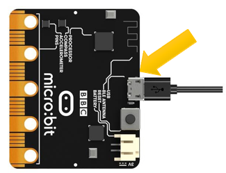

# Capítulo 1 - Matriz de LED
## Descripción del proyecto 1.1
Este proyecto tiene como objetivo crear una animación en la matriz de LEDS de un corazon parpadeando.

### Hardware necesario
- Micro:bit
- Micro Usb


### Esquema de conexión
<p style="text-align: center;">
    
</p>

### Código fuente
``` rust
{{#include src/main.rs}}
```

## Descripción del proyecto 1.2
Se pretende desplazar el corazón del segundo frame del ejercicio anterior fuera de la matriz de LEDS.

### Hardware necesario
- Micro:bit
- Micro Usb

### Esquema de conexión
<p style="text-align: center;">
    
</p>

### Código fuente
``` rust
{{#include examples/heart_move.rs}}
```
### Comando de ejecución
``` console
$cargo run --example heart_move
``` 

## Descripción del proyecto 1.3
Se pretende mostrar una secuencia de números en la matriz de LEDS, donde cada número se mostrará durante un segundo antes de pasar al siguiente.

### Hardware necesario
- Micro:bit
- Micro Usb

### Esquema de conexión
<p style="text-align: center;">
    
</p>

### Código fuente
``` rust
{{#include examples/numbers.rs}}
```

### Comando de ejecución
``` console
$cargo run --example numbers
``` 

## Descripción del proyecto 1.4
Se pretende mostrar un conjunto de números deslizándose por la matriz de LEDS.

### Hardware necesario
- Micro:bit
- Micro Usb


### Esquema de conexión
<p style="text-align: center;">
    
</p>

### Código fuente
``` rust
{{#include examples/text_scroll.rs}}
```

### Comando de ejecución
``` console
$cargo run --example text_scroll
``` 

## Código fuente de ayuda
``` rust
{{#include examples/lib_cap.rs}}
```