# Capítulo 3 - Led
En esta sección aprenderemos a controlar los LEDs de la MB2.

## Descripción del proyecto 3.1
Este proyecto tiene como objetivo de hacer parpadear un único LED externo.

### Hardware necesario
- Micro:bit
- Micro Usb
- Placa de Extensión
- Placa de conexión
- Cable de conexión
- Resistencia de 220 ohmios
- Un Led
<p style="text-align: center;">
    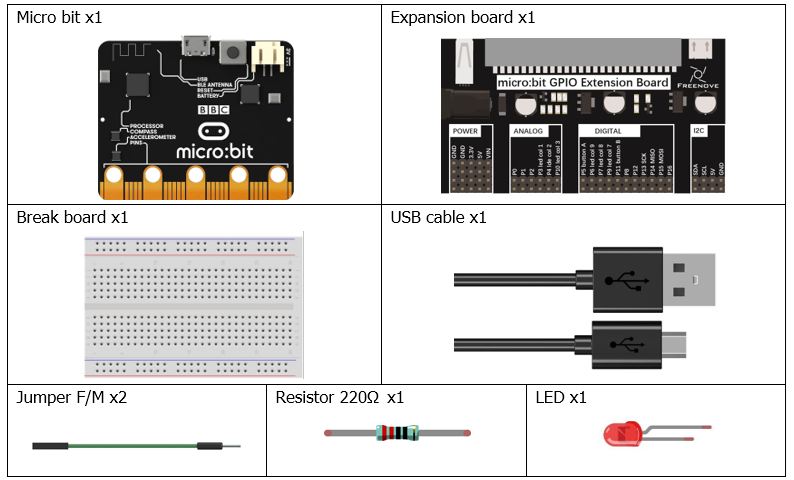
</p>

### Conociendo los componentes
#### Circuito integrado micro:bit
La unidad de intensidad (I) es el amperio (A). 1 A = 1 000 mA, 1 mA = 1 000 μA.
Para que haya intensidad, es necesario un circuito cerrado formado por componentes electrónicos. En la siguiente figura: a la izquierda hay un circuito cerrado, por lo que la intensidad circula por el circuito. A la derecha no hay un circuito cerrado, por lo que no hay intensidad.
<p style="text-align: center;">
    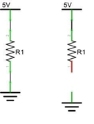
</p>

#### Resistencias
Las resistencias utilizan el ohmio (Ω) como unidad de medida de su resistencia (R). 1 MΩ = 1 000 kΩ, 1 kΩ = 1 000 Ω. Una resistencia es un componente eléctrico pasivo que limita o regula el flujo de corriente en un circuito electrónico. A la izquierda vemos una representación física de una resistencia, y a la derecha está el símbolo que se utiliza para indicar la presencia de una resistencia en un diagrama de circuito o esquema.
<p style="text-align: center;">
    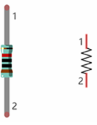
</p>

Las bandas de color de una resistencia constituyen un código abreviado que se utiliza para identificar su valor de resistencia. Para obtener más detalles sobre los códigos de colores de las resistencias, consulta la ficha incluida en el paquete del kit.

Con una tensión fija, cuanto mayor sea la resistencia añadida al circuito, menor será la corriente de salida. La relación entre corriente, tensión y resistencia se puede expresar mediante esta fórmula: I = V/R, conocida como la ley de Ohm, donde I = corriente, V = tensión y R = resistencia. Si se conocen los valores de dos de estos tres parámetros, se puede calcular el valor del tercero.
En el siguiente diagrama, la corriente que atraviesa R1 es: I = V/R = 5 V / 10 kΩ = 0,0005 A = 0,5 mA.
<p style="text-align: center;">
    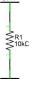
</p>

>**ADVERTENCIA**: Nunca conectes los dos polos de una fuente de alimentación con ningún elemento de baja resistencia (por ejemplo, un objeto metálico o un cable pelado), ya que esto provoca un cortocircuito y genera una corriente elevada que puede dañar la fuente de alimentación y los componentes electrónicos.

> **Nota:** A diferencia de los LEDs y los diodos, las resistencias no tienen polos y son no polares (no importa en qué dirección se inserten en un circuito, funcionarán igual).

#### Seña Analógica y Digital
Una señal analógica es una señal continua tanto en el tiempo como en su valor. Por el contrario, una señal digital o de tiempo discreto es una serie temporal formada por una secuencia de magnitudes. La mayoría de las señales que encontramos en la vida cotidiana son señales analógicas. Un ejemplo conocido de señal analógica sería cómo la temperatura varía continuamente a lo largo del día y no podría cambiar de forma repentina e instantánea de 0 ℃ a 10 ℃.
Sin embargo, el valor de las señales digitales puede cambiar instantáneamente. Este cambio se expresa numéricamente mediante los números 1 y 0 (la base del código binario). Sus diferencias se aprecian más fácilmente al compararlas en un gráfico como el que se muestra a continuación.
<p style="text-align: center;">
    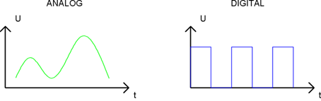
</p>

Ten en cuenta que las señales analógicas son ondas curvas y las señales digitales son "ondas cuadradas". En aplicaciones prácticas, solemos utilizar el sistema binario como señal digital, es decir, una secuencia de ceros y unos. Dado que una señal binaria solo tiene dos valores (0 o 1), ofrece una gran estabilidad y fiabilidad. Por último, tanto las señales analógicas como las digitales pueden convertirse unas en otras.

#### Nivel bajo y alto de tensión
En los circuitos, los valores binarios (0 y 1) se representan como nivel bajo y nivel alto. El nivel bajo suele ser igual a la tensión de tierra (0 V). El nivel alto suele ser igual a la tensión de funcionamiento de los componentes.

El nivel bajo del Micro:bit es de 0 V y el nivel alto es de 3,3 V, tal y como se muestra a continuación. Cuando el puerto de E/S del Micro:bit emite un nivel alto, se pueden controlar directamente componentes de bajo consumo, como los LEDs.

<p style="text-align: center;">
    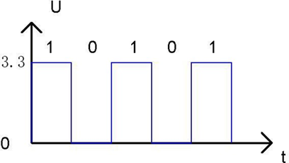
</p>

#### Conectores
Un "cable conector" es un tipo de cable diseñado para conectar componentes entre sí mediante la inserción de sus dos terminales. Los conectores tienen un extremo macho (pin) y un extremo hembra (ranura), por lo que se pueden clasificar en los tres tipos siguientes.
<p style="text-align: center;">
    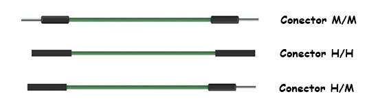
</p>

#### Placa de pruebas
En la placa de pruebas hay muchos orificios pequeños para unir los conectores.
Algunos de estos orificios están enlazados entre sí en el interior de la placa. Aquí tenemos una pequeña placa de pruebas a modo de ejemplo de cómo están conectadas eléctricamente las filas de orificios (zócalos). La imagen de la izquierda muestra cómo los pines comparten la conexión eléctrica, y la de la derecha muestra el metal interno que une eléctricamente estas filas.
<p style="text-align: center;">
    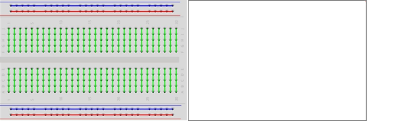
</p>

#### Led (Externo)
Un LED es un tipo de diodo. Todos los diodos solo funcionan si la corriente circula en la dirección correcta y tienen dos polos. Un LED solo se iluminará si la patilla más larga (+) del LED se conecta al polo positivo de una fuente de alimentación y la patilla más corta se conecta al polo negativo (-) de la misma, también denominado tierra (GND). Este tipo de componente se conoce como "polar" (piensa en una calle de sentido único).

Todos los diodos comunes de dos terminales son iguales en este aspecto. Los diodos solo funcionan si la tensión de su electrodo positivo es superior a la de su electrodo negativo, y la mayoría de los diodos tienen un rango de tensión de funcionamiento muy reducido, comprendido entre 1,9 y 3,4 V. Si se aplica una tensión muy superior a 3,3 V, el LED se dañará y se fundirá.

<p style="text-align: center;">
    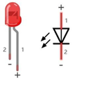
</p>

>**Nota:** Los LEDs no se pueden conectar directamente a una fuente de alimentación, ya que esto suele provocar daños en el componente. Es necesario conectar en serie una resistencia con un valor de resistencia específico al LED que se vaya a utilizar.

### Esquema de conexión
Al realizar el cableado, se recomienda desconectar todas las fuentes de alimentación del circuito y, a continuación, montar el circuito siguiendo el esquema (la placa micro:bit no se puede insertar al revés), el polo positivo del LED (pin largo) debe conectarse a la resistencia, mientras que su polo negativo (pin corto) debe conectarse a GND. Una vez montado y comprobado que el circuito es correcto, utiliza el cable USB para conectar el ordenador al micro:bit y alimentar el circuito.

>**PRECAUCIÓN**: ¡Evita cualquier posible cortocircuito (especialmente al conectar 5 V o GND, 3,3 V y GND)! ADVERTENCIA: ¡Un cortocircuito puede provocar una corriente elevada en tu circuito, generar un calor excesivo en los componentes y causar daños permanentes en tu micro:bit!

>**Nota**: Patilla larga del diodo conectada en la misma columna que la resistencia, patilla corta del diodo conectada en la misma columna que GND.

<p style="text-align: center;">
    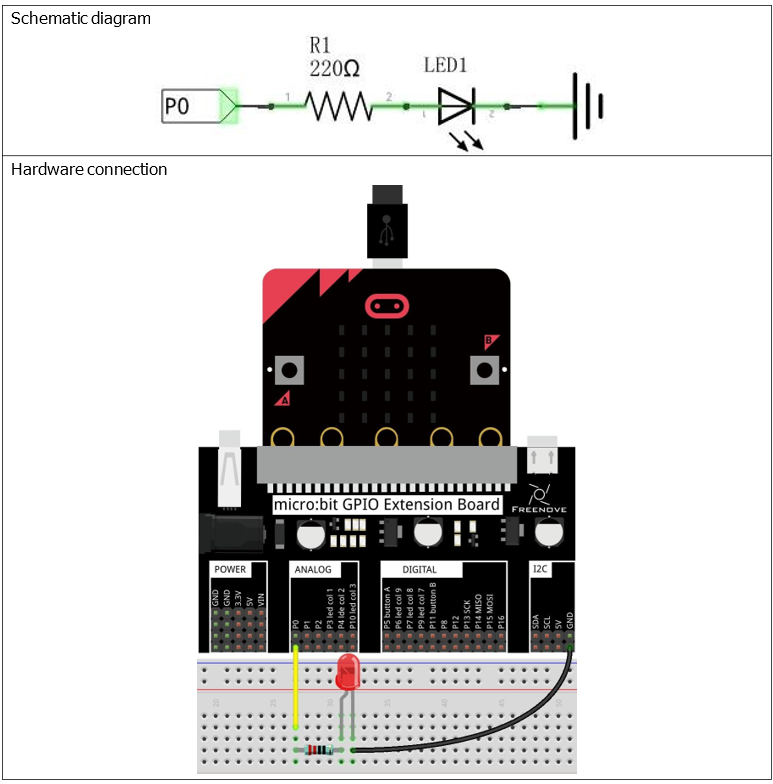
</p>

>**El puerto a usar sería el P0, el pin a utilizar el 02.**

Veamos la siguiente imagen para entenderlo mejor. Si partimos de la placa de expansión (Expansion connector), queremos usar el conector **P0** (ver imagen anterior, cable amarillo) que se rotula como **RING0**. Esta marca nos lleva en la MCU al pin 02 del puerto P0. Por tanto, activando y desactivando este pin de la MCU lograremos encender/apagar el led de la placa.
<p style="text-align: center;">
    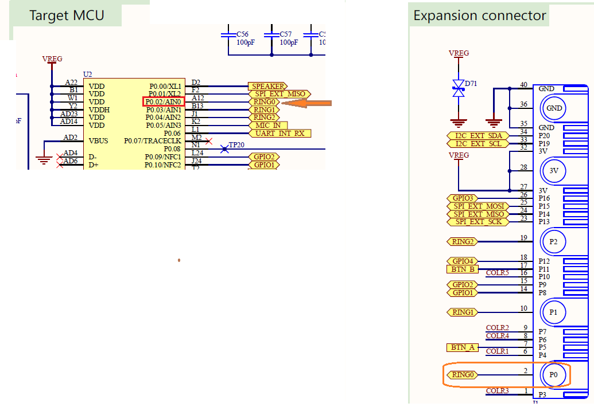
</p>

### Código fuente
``` rust
{{#include src/main.rs}}
```

#### Explicación del código
Ahora que tenemos un poco de experiencia programando, ha llegado el momento de entender la estructura de las librerías en Rust, pero antes resolvemos una pequeña duda que nos puede surgir al leer el código fuente. Por qué: `board.edge.e00.into_push_pull_output(Level::Low);`. En la siguiente sección los explicaremos a fondo, pero por ahora nos basta con saber que esta línea de código configura el pin **P2** del puerto **P0** como salida digital y lo inicializa en nivel bajo (apagado), tal y como requiere el ejercicio.
