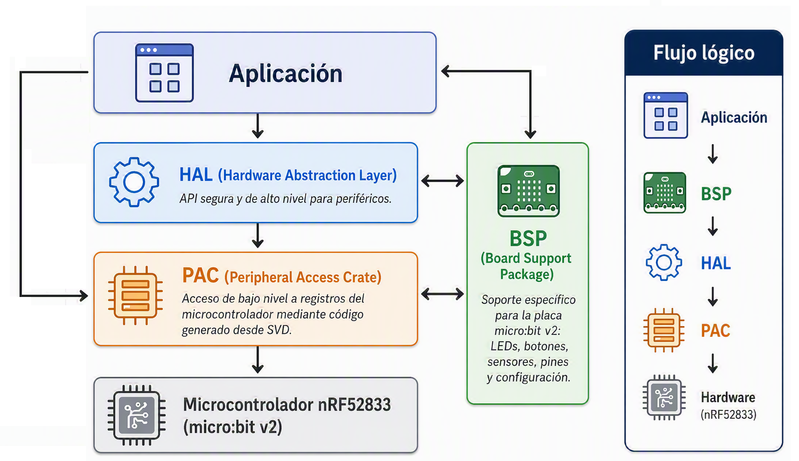
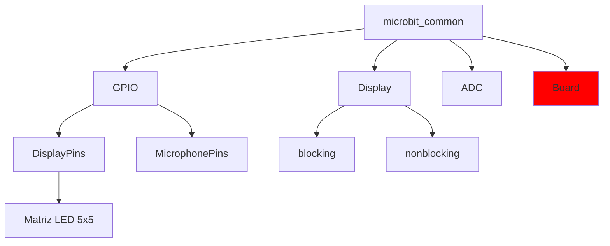
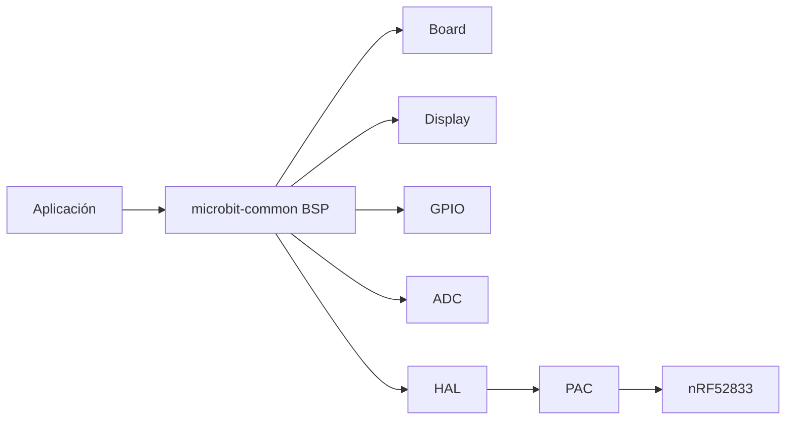

## Estructura de las librerías Rust
Ahora que hemos avanzado en la comprensión del hardware y software, es el momento de profundizar en la estructura de las librerías Rust. En este apartado, se explicará la estructura de las librerías y cómo se relacionan entre sí. 

En la imagen siguiente se puede ver un esquema de la estructura de las librerías Rust que vamos a usar para programar la micro:bit. En concreto siempre que podamos nos quedaremos al mayor nivel posible (BSP).
<p style="text-align: center;">
    
</p>


### PAC
El trabajo del PAC es proporcionar una interfaz directa (más o menos segura) a los periféricos del chip, permitiendo configurar cada bit como queramos (por supuesto, también de forma incorrecta). Por lo general, solo habrá que lidiar con el PAC si las capas superiores no recogen todas las necesidades o cuando estemos desarrollando código de nivel superior para ellas. No es sorprendente que el PAC que vamos a usar (en su mayoría implícitamente) sea para el nRF52.

>**NOTA:** El PAC actual está basado en la versión 1.3 de la especificación del producto, aunque la acutal es la versión 1.7, por lo que podríamos encontrarnos con algunas diferencias. Sin embargo, la mayoría de las funciones que vamos a usar no han cambiado, por lo que no debería ser un problema.

### HAL
La función del HAL es construir sobre el PAC del chip una capa y proporcionar una abstracción superior que sea realmente utilizable para alguien que no conoce todo el comportamiento del chip. Normalmente, la capa HAL abstrae los periféricos completos en estructuras individuales que pueden, por ejemplo, usarse para enviar datos a través del periférico. Vamos a usar el nRF52-hal.

### BSP
La tarea del BSP es abstraer toda una placa (como la micro:bit) de una vez. Eso significa que tiene que proporcionar utilidades para usar tanto el microcontrolador como los sensores, LED, etc. que puedan estar presentes. Con bastante frecuencia (especialmente con placas hechas a medida) no existirá ningún BSP. En su lugar, trabajaremos con un HAL para el chip y construiremoslos controladores para los sensores nosotros o los buscaremos en crates.io. Afortunadamente, la MB2 sí tiene un BSP, así que vamos a usarlo junto con el HAL. 

El crate actual que vamos a usar es [microbit-common](https://docs.rs/microbit-common/latest/microbit_common/), que proporciona una abstracción de la placa MB2. La estructura principal de este crate es board, que representa la placa micro:bit y proporciona acceso a todos los periféricos y sensores de la placa. La estructura `Board` se puede acceder utilizando el método `Board::take()`, que devuelve una instancia de ella si no se ha creado ninguna otra previamente. Una vez que se tiene la instancia, se puede acceder a los periféricos y sensores de la placa a través de sus campos públicos. 

>**Nota:** La estructura `Board` es un singleton, lo que significa que solo puede haber una instancia en todo el programa. Esto se debe a que la placa MB2 tiene recursos limitados y no se pueden compartir entre múltiples instancias. Por lo tanto, si se intenta crear una segunda, se devolverá `None`.
```rust
let board = Board::take().unwrap();

let mut timer = Timer::new(board.TIMER0);
let mut led = board.edge.e00.into_push_pull_output(Level::Low);
```

>**Nota:** el crate original que tenemos que usar es `microbit`, pero este lo único que hace es incluir el crate microbit-common y añadirle un par de cosas más, por lo que vamos a investigar directamente microbit-common.
```rust
use microbit::Board;
```



### Estructura Board
Se puede acceder a toda la documentación de la estructura en [Board](https://docs.rs/microbit-common/latest/microbit_common/board/struct.Board.html)

#### Recursos de la placa
| Nombre            | Tipo                  | Descripción                                                         |
| ----------------- | --------------------- | ------------------------------------------------------------------- |
| `pins`            | `Pins`                | Pines GPIO que no están asignados a otros dispositivos de la placa. |
| `edge`            | `Edge`                | Pines disponibles en el conector de borde de la micro:bit.          |
| `display_pins`    | `DisplayPins`         | Pines utilizados por la matriz LED 5×5.                             |
| `buttons`         | `Buttons`             | Acceso a los botones de usuario de la placa.                        |
| `speaker_pin`     | `P0_00<Disconnected>` | Pin asociado al altavoz integrado.                                  |
| `microphone_pins` | `MicrophonePins`      | Pines relacionados con el micrófono integrado.                      |
| `i2c_internal`    | `I2CInternalPins`     | Bus I²C utilizado internamente por la placa.                        |
| `i2c_external`    | `I2CExternalPins`     | Bus I²C accesible para dispositivos externos.                       |
| `uart`            | `UartPins`            | Pines UART conectados al depurador/interfaz USB.                    |

#### Periféricos del núcleo ARM Cortex-M4
| Nombre  | Tipo    | Descripción                                                  |
| ------- | ------- | ------------------------------------------------------------ |
| `CBP`   | `CBP`   | Operaciones de mantenimiento de caché y predictor de saltos. |
| `CPUID` | `CPUID` | Información de identificación de la CPU.                     |
| `DCB`   | `DCB`   | Debug Control Block.                                         |
| `DWT`   | `DWT`   | Data Watchpoint and Trace.                                   |
| `FPB`   | `FPB`   | Flash Patch and Breakpoint.                                  |
| `FPU`   | `FPU`   | Unidad de coma flotante.                                     |
| `ITM`   | `ITM`   | Instrumentation Trace Macrocell.                             |
| `MPU`   | `MPU`   | Memory Protection Unit.                                      |
| `NVIC`  | `NVIC`  | Controlador de interrupciones anidadas.                      |
| `SCB`   | `SCB`   | System Control Block.                                        |
| `SYST`  | `SYST`  | Temporizador SysTick.                                        |
| `TPIU`  | `TPIU`  | Trace Port Interface Unit.                                   |

#### Periféricos del nRF52833
| Nombre   | Tipo     | Descripción                                  |
| -------- | -------- | -------------------------------------------- |
| `CLOCK`  | `CLOCK`  | Control de relojes del sistema.              |
| `FICR`   | `FICR`   | Factory Information Configuration Registers. |
| `GPIOTE` | `GPIOTE` | Eventos y tareas GPIO.                       |
| `PPI`    | `PPI`    | Interconexión directa entre periféricos.     |
| `PWM0`   | `PWM0`   | Generador PWM 0.                             |
| `PWM1`   | `PWM1`   | Generador PWM 1.                             |
| `PWM2`   | `PWM2`   | Generador PWM 2.                             |
| `PWM3`   | `PWM3`   | Generador PWM 3.                             |
| `RADIO`  | `RADIO`  | Subsistema radio Bluetooth LE / 2.4 GHz.     |
| `RNG`    | `RNG`    | Generador de números aleatorios hardware.    |
| `RTC0`   | `RTC0`   | Real Time Counter 0.                         |
| `RTC1`   | `RTC1`   | Real Time Counter 1.                         |
| `RTC2`   | `RTC2`   | Real Time Counter 2.                         |
| `TEMP`   | `TEMP`   | Sensor interno de temperatura.               |
| `TIMER0` | `TIMER0` | Temporizador hardware 0.                     |
| `TIMER1` | `TIMER1` | Temporizador hardware 1.                     |
| `TIMER2` | `TIMER2` | Temporizador hardware 2.                     |
| `TIMER3` | `TIMER3` | Temporizador hardware 3.                     |
| `TIMER4` | `TIMER4` | Temporizador hardware 4.                     |
| `TWIM0`  | `TWIM0`  | Controlador I²C maestro.                     |
| `TWIS0`  | `TWIS0`  | Controlador I²C esclavo.                     |
| `UARTE0` | `UARTE0` | UART con EasyDMA.                            |
| `UARTE1` | `UARTE1` | UART con EasyDMA.                            |
| `ADC`    | `SAADC`  | Convertidor analógico-digital.               |
| `POWER`  | `POWER`  | Gestión de energía.                          |
| `SPI0`   | `SPI0`   | Controlador SPI 0.                           |
| `SPI1`   | `SPI1`   | Controlador SPI 1.                           |
| `SPI2`   | `SPI2`   | Controlador SPI 2.                           |
| `UART0`  | `UART0`  | UART clásico.                                |
| `TWI0`   | `TWI0`   | I²C clásico.                                 |
| `TWI1`   | `TWI1`   | I²C clásico.                                 |
| `SPIS1`  | `SPIS1`  | SPI esclavo.                                 |
| `ECB`    | `ECB`    | Cifrado AES ECB.                             |
| `AAR`    | `AAR`    | Address Resolution Accelerator.              |
| `CCM`    | `CCM`    | Cifrado CCM para Bluetooth LE.               |
| `WDT`    | `WDT`    | Watchdog Timer.                              |
| `QDEC`   | `QDEC`   | Decodificador de codificador rotatorio.      |
| `LPCOMP` | `LPCOMP` | Comparador de baja potencia.                 |
| `NVMC`   | `NVMC`   | Controlador de memoria no volátil.           |
| `UICR`   | `UICR`   | User Information Configuration Registers.    |


#### Métodos principales
| Método                      | Descripción                                                                                                                    |
|-----------------------------| ------------------------------------------------------------------------------------------------------------------------------ |
| `Board::take()`             | Obtiene la instancia de la placa de forma segura. Solo puede ejecutarse una vez. Las llamadas posteriores devuelven `None`.    |
| `Board::new(p, cp)`         | Construye una instancia de `Board` a partir de unos `Peripherals` y `CorePeripherals` que ya hayan sido obtenidos previamente. |

### Resumen
microbit-common actúa como BSP (Board Support Package) para la BBC micro:bit v2. Reexporta HAL y PAC, proporciona abstracciones de placa, GPIO nombrados, soporte para la matriz LED y acceso simplificado a periféricos.



### Código de ejemplo
A modo de ejemplo hemos rehecho el mismo código que en el apartado anterior, pero usando solo el PAC. Veámoslo:
``` rust
{{#include examples/main_pac.rs}}
```