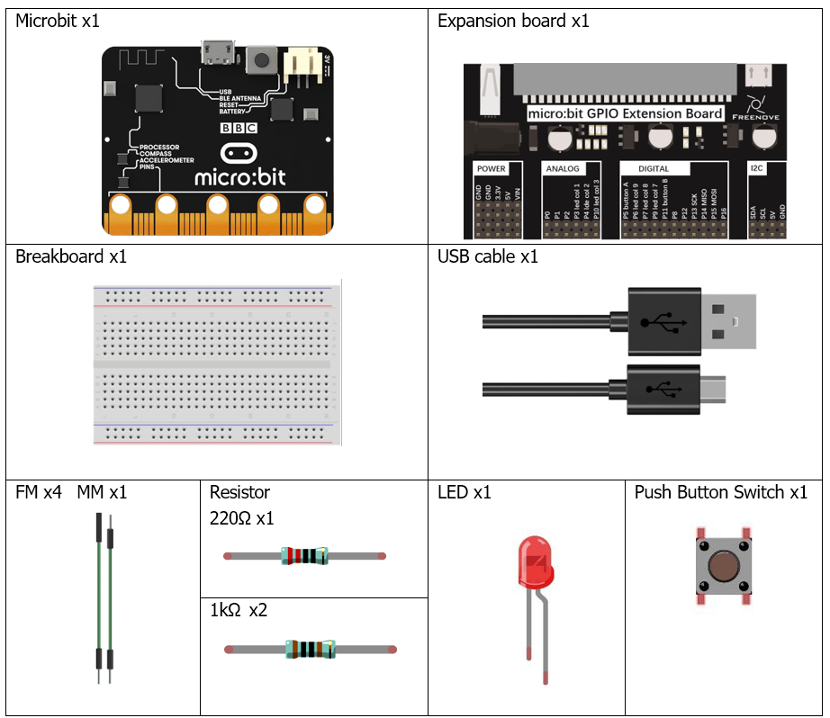
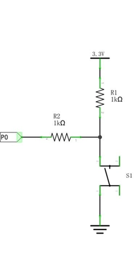
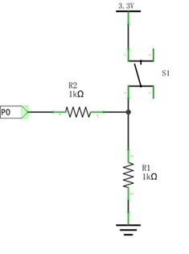
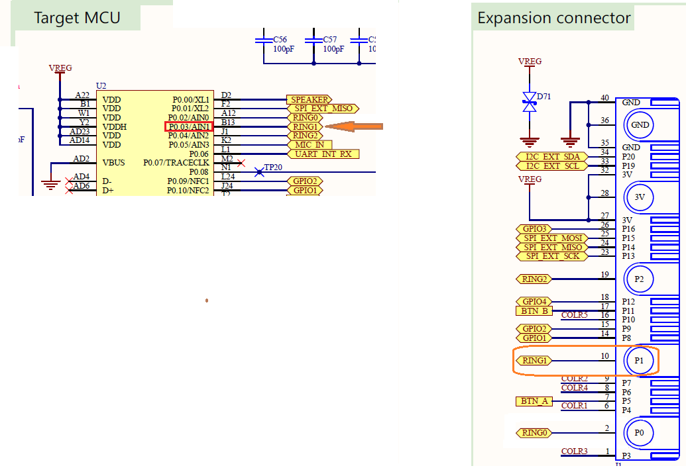
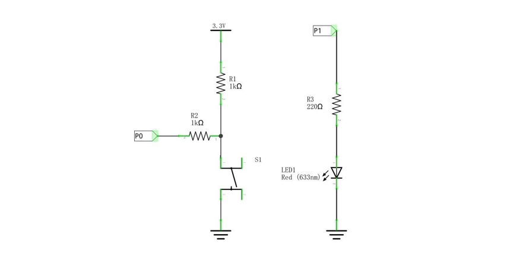
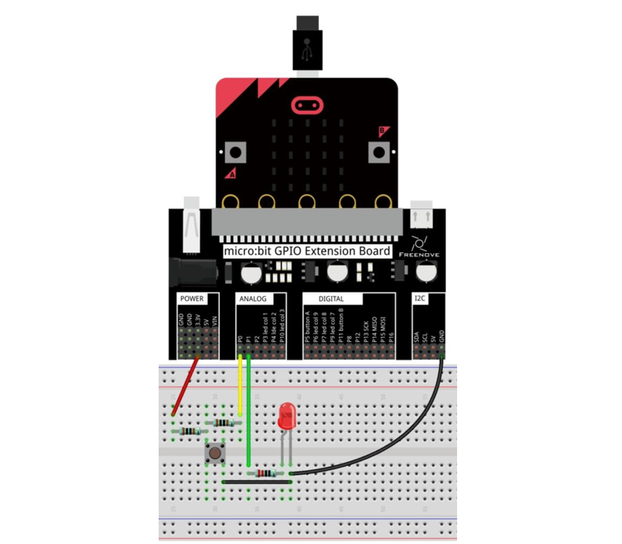
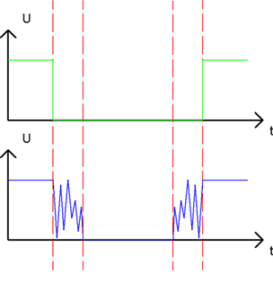

# Capítulo 4 - Botones y Led
Por lo general, un dispositivo de control automático completo consta de tres partes esenciales: ENTRADA, SALIDA y CONTROL. En la sección anterior, el módulo LED era la parte de salida y el micro:bit, la parte de control. En aplicaciones prácticas, no solo hacemos que los LEDs parpadeen, sino que también conseguimos que un dispositivo detecte el entorno que le rodea, reciba instrucciones y, a continuación, realice la acción adecuada, como encender los LED, hacer sonar un zumbador, etc.

## Descripción del proyecto 4.1
En este proyecto, controlaremos el estado del LED mediante un pulsador. Cuando se pulse el botón, el LED se encenderá, y cuando se suelte, el LED se apagará. Esto es lo que se conoce como un interruptor momentáneo. Utilizaremos un bucle de espere activa para programarlol.

### Hardware necesario
<p style="text-align: center;">
    
</p>

### Conociendo los componentes
#### Conexión del interruptor de botón
Conectamos un interruptor de botón directamente al circuito para encender o apagar el LED. En los circuitos digitales, debemos utilizar el interruptor de botón como señal de entrada. La conexión recomendada es la siguiente:
<p style="text-align: center;">
    
</p>

En el esquema de circuitos anterior, cuando no se pulsa el botón, el puerto de E/S detectará 3,3 V (nivel alto); y cuando se pulsa el botón, detectará 0 V (nivel bajo). La resistencia R2 se utiliza aquí para evitar que el puerto pase accidentalmente a un nivel alto de salida. Sin la R2, el puerto podría conectarse directamente al cátodo y provocar un cortocircuito al pulsar el botón.

El siguiente diagrama muestra otra conexión, en la que el nivel detectado por el puerto de E/S es el contrario al del diagrama anterior, independientemente de si se pulsa el botón o no.
<p style="text-align: center;">
    
</p>

### Esquema de conexión
> El pin P0 detecta el botón y el pin P1 controla el LED (P0_03 - RING1 - Board.edge.e01). 
> 
<p style="text-align: center;">
    
</p>

#### Diagrama esquemático
<p style="text-align: center;">
    
</p>
<p style="text-align: center;">
    
</p>


### Código fuente
``` rust
{{#include src/main.rs}}
```

#### Explicación del código
El código es bastante sencillo, en este caso establecemos el P0 como entrada y el P1 como salida. Cuando se detecta que el botón está pulsado, se enciende el LED; cuando se detecta que el botón está suelto, se apaga el LED.

## Descripción del proyecto 4.2
En este proyecto, vamos a fabricar una lámpara de mesa. Los componentes y circuitos utilizados son exactamente los mismos que en el proyecto anterior, pero esta funcionará de forma diferente: al pulsar el botón, el LED se encenderá, y al volver a pulsarlo, el LED se apagará. La acción del interruptor ya no es momentánea (como un timbre), sino que permanece encendido sin necesidad de mantener pulsado el interruptor de botón.

### Hardware necesario
El mismo

### Conociendo los componentes
#### Rebote del botón
<p style="text-align: center;">
    
</p>

Cuando se pulsa un interruptor de botón, no pasa de un estado a otro de forma inmediata. Debido a unas minúsculas vibraciones mecánicas, se produce un breve periodo de oscilación continua antes de que se estabilice en el nuevo estado; este proceso es demasiado rápido para que los seres humanos lo detecten, pero no para los microcontroladores. Lo mismo ocurre cuando se suelta el interruptor del botón. Este fenómeno no deseado se conoce como "rebote".

Por lo tanto, si procedemos a detectar directamente el estado del pulsador, se producen múltiples acciones de pulsación y liberación en un mismo ciclo de pulsación. Estas oscilaciones pueden confundir el funcionamiento a alta velocidad del microcontrolador y provocar numerosos errores. Por ello, debemos eliminar el impacto de dichas oscilaciones. 

Nuestra solución: evaluar el estado del pulsador varias veces. Solo cuando el estado del pulsador sea estable (constante) durante un periodo de tiempo, ¿Puede indicar que el botón se encuentra realmente en el estado "ON" (pulsado)?

Este proyecto requiere los mismos componentes y circuitos que utilizamos en la sección anterior.

### Esquema de conexión
El mismo que en la sección anterior.

### Código fuente
``` rust
{{#include examples/lamp.rs}}
```

#### Explicación del código
En el programa, cuando se detecta por primera vez que se ha pulsado el botón, se espera 10 ms para comprobar si se vuelve a pulsar el botón, con el fin de eliminar el efecto del rebote al pulsarlo. Y si el botón sigue pulsado por segunda vez, se considera que se ha pulsado y que se encuentra en un estado estable. De lo contrario, se considera que se trata de un rebote y se sale de esta comprobación.

Cuando se detecte que se ha pulsado, cambia el valor de "status". "Status" se utiliza para guardar el estado del LED. A continuación, escribe el nuevo valor en el puerto P1 para controlar el LED.

Una vez realizadas las operaciones anteriores, el programa detectará si se ha soltado el botón. Primero eliminará el rebote del botón mediante el while.