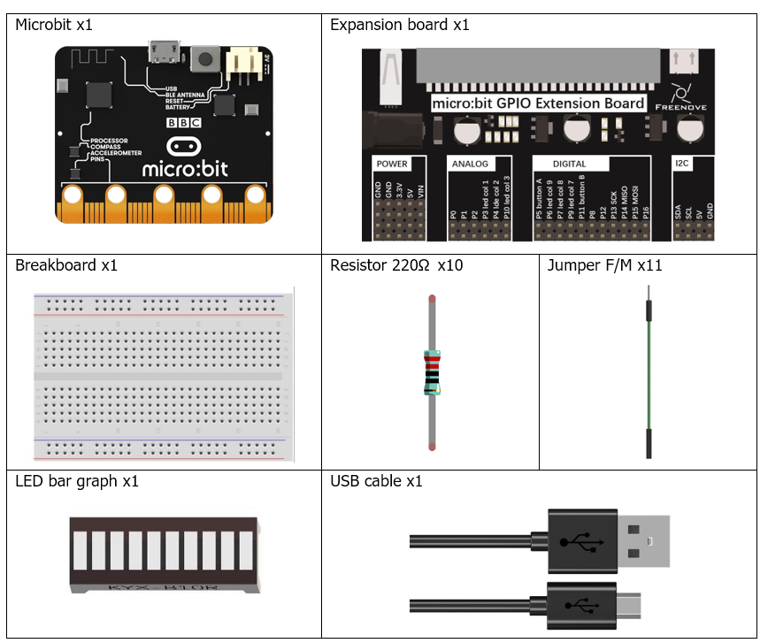
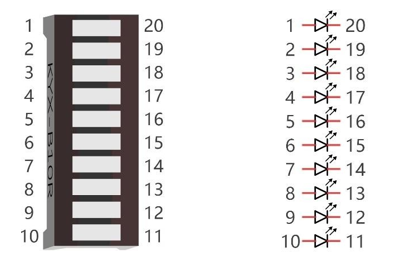
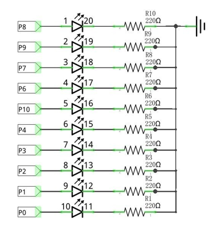
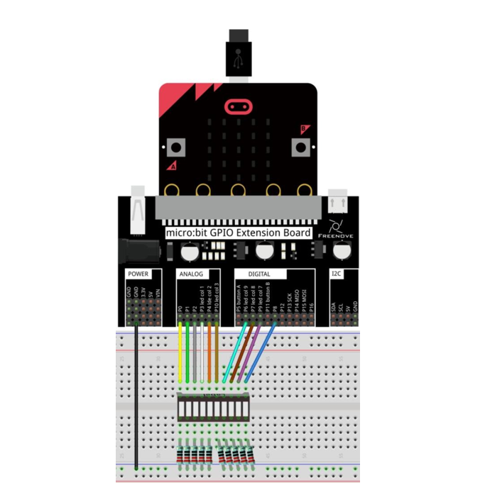

# Capítulo 5 - Barra de Led
## Descripción del proyecto 5.1
En este proyecto, utilizamos una barra LED para crear una luz que simula el agua fluyendo.
### Hardware necesario
<p style="text-align: center;">
    
</p>

### Conociendo los componentes
#### Barra Led
Una barra LED cuenta con 10 LEDs integrados en un único componente. Las dos filas de pines situadas en su parte inferior están emparejadas para identificar cada LED, al igual que el LED individual utilizado anteriormente.

<p style="text-align: center;">
    
</p>


### Esquema de conexión
#### Diagrama esquemático

<p style="text-align: center;">
    
</p>
<p style="text-align: center;">
    
</p>

>**Nota:** Si el proyecto no funciona, asegúrate de que la barra LED está conectada correctamente. Prueba a girar la barra led 180º..

### Código fuente
> Los pines a usar son: P0, P1, P2, P3, P4, P10, P6, P7, P9 y P8.
> 
>Se nombran como RING0, RING1, RING2, COLR3, COLR1, COLR5, COLR4, COLR2, GPIO2, GPIO1 respectivamente.
>
> Se corresponden con: P0.02, P0.03, P0.04, P0.31, P0.28, P0.30, P1.05, P0.11, P0.09, P0.10.
>
> En Rust:  board.edge.e00,
board.edge.e01,
board.edge.e02,
board.display_pins.col3,
board.display_pins.col1,
board.display_pins.col5,
board.display_pins.col4,
board.display_pins.col2,
board.edge.e09,
board.edge.e08

``` rust
{{#include src/main.rs}}
```
``` shell
cargo run
``` 

#### Explicación del código
Este código es sencillo, enciende de forma secuencialy apaga cada uno de los pines necesarios dentro de un bucle infinito, usando un retardo de 500 milisegundos.

### Código fuente (versión dos)
``` rust
{{#include examples/main_for.rs}}
```
``` shell
cargo run --example main_for
``` 

#### Explicación del código
En este caso vamos a usar un Array para almacenar los pines de la barra led, y un bucle for para recorrerlos. Esto nos permite encender y apagar los leds de manera más eficiente y con menos código.
