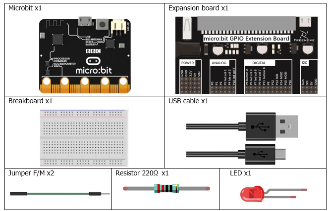
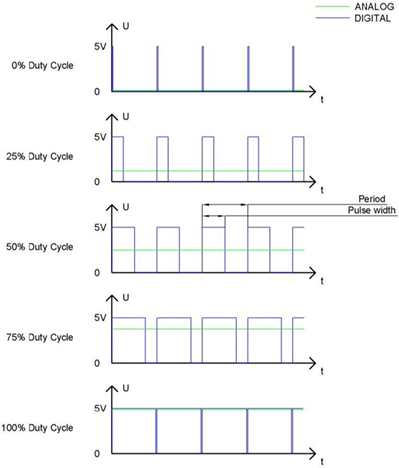
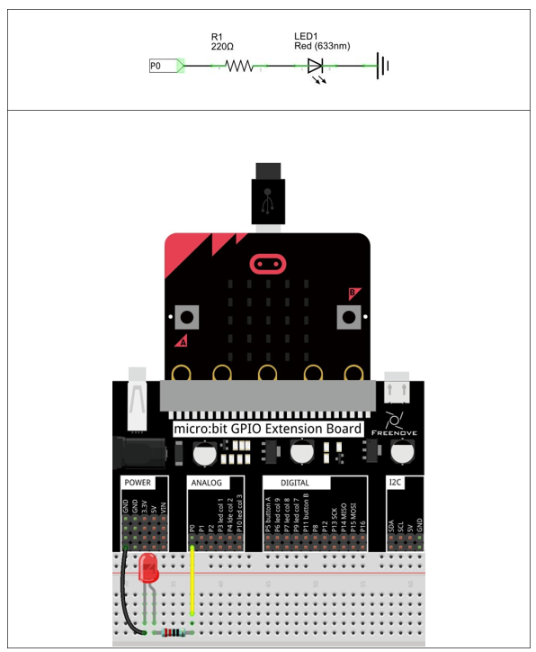

# Capítulo 6 - PWM
## Descripción del proyecto
Vamos a aprender a hacer parpadear un led de manera gradual, es decir, que vaya aumentando y disminuyendo su brillo. Para ello vamos a utilizar la técnica de modulación por ancho de pulso (PWM).
### Hardware necesario
<p style="text-align: center;">
    
</p>

### Conociendo los componentes
#### PWM
La PWM (modulación por ancho de pulso) es un método muy eficaz para utilizar señales digitales con el fin de controlar circuitos analógicos. Los procesadores digitales no pueden generar directamente señales analógicas. La tecnología PWM facilita enormemente esta conversión (la transformación de señales digitales en analógicas).

La tecnología PWM utiliza pines digitales para enviar ondas cuadradas de determinadas frecuencias, es decir, señales de nivel alto y nivel bajo que se alternan durante un tiempo determinado. El tiempo total de cada conjunto de niveles altos y bajos suele ser fijo, lo que se denomina «período» (Nota: el recíproco del período es la frecuencia). El tiempo de las salidas de nivel alto se denomina generalmente «anchura de pulso», y el ciclo de trabajo es el porcentaje que representa la relación entre la duración del pulso, o anchura de pulso (PW), y el período total (T) de la forma de onda.

Cuanto más dure la salida de los niveles altos, mayor será el ciclo de trabajo y mayor será la tensión correspondiente en la señal analógica. Las siguientes figuras muestran cómo varían las tensiones de la señal analógica entre 0 V y 5 V (el nivel alto es 5 V) en función de la anchura del pulso del 0 % al 100 %:

<p style="text-align: center;">
    
</p>

Cuanto más largo sea el ciclo de trabajo del PWM, mayor será la potencia de salida. Ahora que comprendemos esta relación, podemos utilizar el PWM para controlar el brillo de un LED o la velocidad de un motor de corriente continua, entre otras cosas.

### Esquema de conexión
#### Diagrama esquemático

<p style="text-align: center;">
    
</p>

>**Nota**: Patilla larga del diodo conectada en la misma columna que la resistencia, patilla corta del diodo conectada en la misma columna que GND.

### Código fuente
> El pin a usar es: P0.
>
>Se nombra como RING0.
>
> Se corresponde con: P0.02.
>
> En Rust: board.edge.e00.
> 

``` rust
{{#include src/main.rs}}
```
``` shell
cargo run
``` 

#### Explicación del código
Definimos un array con los valores de ciclo de trabajo que queremos usar para el PWM. En este caso, vamos a hacer que el LED vaya aumentando y disminuyendo su brillo de manera gradual. Para ello, definimos un array con valores que van desde 0 hasta 32000 (el valor máximo para un PWM de 15 bits es 32767) y luego volvemos a 0.
``` rust
let duty_values = [0, ...
```
El código a partir de ahí es sencillo, inicialimamos el módulo PWM. Unimos el canal 0 del mismo al pin P0 del conector externo (P0.02 o RING0) correspondiente, después con dos bucles uno para incrementar el brillo y otro para decrementarlo, establecemos el valor del ciclo y esperamos un pequeño tiempo para que no sea muy rápido el cambio. Entre cada bucle aguardaremos un tiempo mayor a la máxima potencia para que la visualización del cambio de brillo sea más clara.