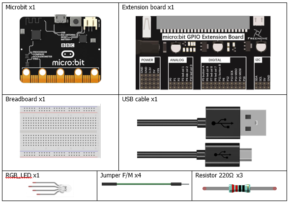
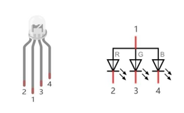
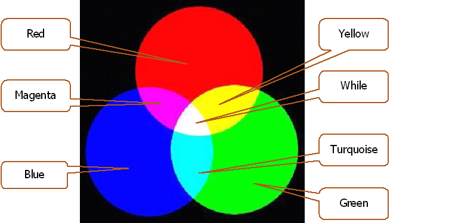
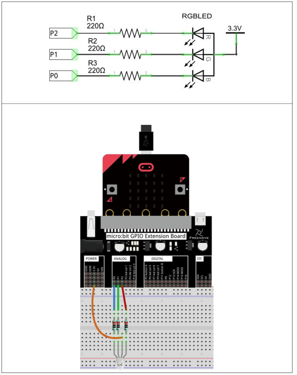
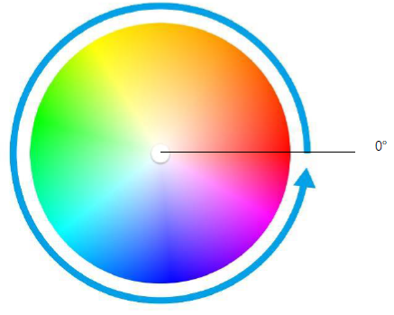

# Capítulo 7 - RGBLed
## Descripción del proyecto 7.1
Vamos a usar el led RGB para mostrar un color.
### Hardware necesario
<p style="text-align: center;">
    
</p>

### Conociendo los componentes
#### Led RGB
Un LED RGB tiene tres LED integrados en un solo componente. Puede emitir luz roja, verde y azul, respectivamente. Para ello, necesita cuatro pines (que es también cómo se identifica). El pin largo (1) es el común, que corresponde al ánodo (+) o terminal positivo; los otros tres son los cátodos (-) o terminales negativos. A continuación se muestra una representación de un LED RGB y su símbolo electrónico. Podemos hacer que un LED RGB emita luz de distintos colores e intensidades controlando los tres ánodos (2, 3 y 4) del LED RGB.


<p style="text-align: center;">
    
</p>

La luz roja, verde y azul se denominan "colores primarios" cuando se habla de luz (Nota: en el caso de los pigmentos, como las pinturas, los tres colores primarios son el rojo, el azul y el amarillo). Al combinar estos tres colores primarios de la luz con distintos niveles de intensidad, se puede producir prácticamente cualquier color de la luz visible. Las pantallas de ordenador, los píxeles individuales de las pantallas de los teléfonos móviles, las lámparas de neón, etc., pueden producir millones de colores gracias a este fenómeno.

<p style="text-align: center;">
    
</p>

Si utilizamos tres señales PWM de 8 bits para controlar el LED RGB, en teoría podemos crear 28 × 28 × 28 = 16 777 216 (16 millones) de colores mediante diferentes combinaciones de intensidad de la luz RGB.

### Esquema de conexión
#### Diagrama esquemático

<p style="text-align: center;">
    
</p>

>**Nota**: Patilla larga del diodo conectada la toma de corriente directamente (3,3V).

### Código fuente
> Los pines a usar son: P0, P1, P2.
>
>Se nombran como RING0, RING1, RING2.
>
> Se corresponden con: P0.02, P0.03, P0.04.
>
> En Rust: board.edge.e00, board.edge.e01, board.edge.e02,

``` rust
{{#include src/main.rs}}
```
``` shell
cargo run
``` 

#### Explicación del código
Para este ejemplo, siguiendo lo aprendido en el capítulo anterior, se utilizan tres canaels del pulso PWM, uno para cada color (Canal 0 para el rojo, Canal 1 para el verde, Canal 2 para el azul). Para estructurar un poco mejor el código se ha creado un módulo color en el que se encuentra una estructura para los valores de los leds y una función para escribir de forma anlógica.

## Descripción del proyecto 7.2
Vamos a usar el led RGB para mostrar diferentes colores basados en el esquema de color HSL.


### Conociendo los componentes
#### HSL
El modo de color HSL es otro estándar de color del sector. Permite obtener una gran variedad de colores modificando los tres canales de color —tono (H), saturación (S) y luminosidad (L)— y superponiéndolos entre sí. Este modo de color abarca casi todos los colores que la visión humana puede percibir. Es uno de los sistemas de color más utilizados hasta la fecha.

Como se muestra en el círculo de tintes que aparece a continuación, el ángulo de 0 grados corresponde al color R (rojo), el de 120 grados al color G (verde) y el de 240 grados al color B (azul). Cada ángulo representa un color. La saturación (S) por defecto toma el valor máximo de 100, mientras que la luminosidad (L) toma el valor de 50. Si se modifica el ángulo de tinte, el color cambiará. Además, el sistema de color HSL se puede convertir al sistema de color RGB para cambiar el color del LED.

<p style="text-align: center;">
    
</p>

### Esquema de conexión
#### Diagrama esquemático
Es el mismo que en el proyecto 7.1.

### Código fuente

``` rust
{{#include examples/hsl.rs}}
```
``` shell
cargo run --example hsl
``` 

#### Explicación del código
El código recorre un bucle de 0 a 360 grados, que es el rango de valores del ángulo de matiz (H) en el sistema de color HSL. Para cada valor del ángulo, se llama a la función hsl_rgb() para convertir el valor HSL al valor RGB correspondiente. Luego, se llama a la función write_analog() para escribir los valores RGB en los pines correspondientes del LED RGB transformando los valores de 0 a 255 en 0 a MAX_DUTY.

Al igual que en el ejercicio anterior, usamos un módulo color para estructurar mejor el código.

##### hsl_rgb(grados_hsl)
Función personalizada que se utiliza para convertir el sistema de color HSL al sistema de color RGB y que devuelve el valor RGB correspondiente al ángulo de matiz actual. Por ejemplo: HSL_RGB(0) devuelve el valor RGB del rojo: rojo=255, verde=0, azul=0.


##### map(valor_rgb)
Esta función convierte un valor del rango 0..255 al rango 0..MAX_DUTY para usar en **write_analog**. Por ejemplo: map(255) devuelve MAX_DUTY, map(0) devuelve 0 y map(127) devuelve MAX_DUTY/2.

El máximo valor de MAX_DUTY depende de la resolución del PWM. En este caso, es $2^{15}$. 

Hay que tener en cuenta que para un valor RGB 0 debe devolver 0, por lo que la fórmula utiliza el valor: $ 1f32 - ...$