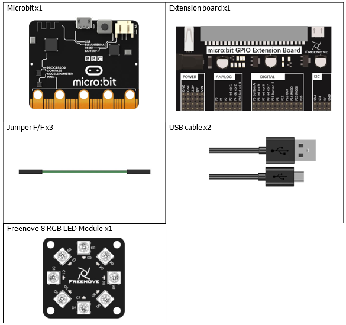
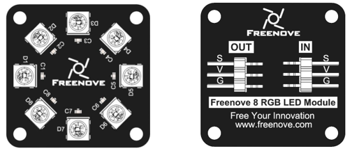
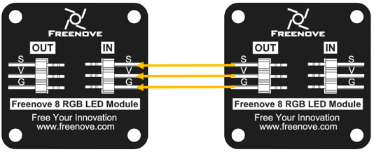
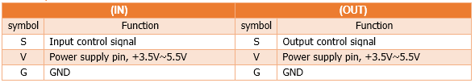
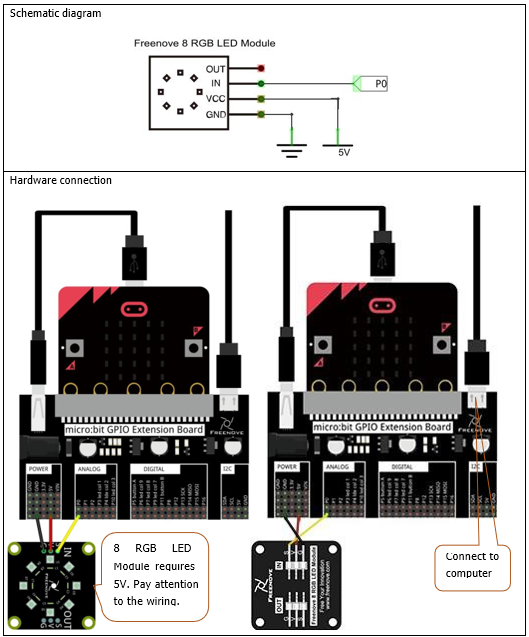

# Capítulo 8 - NeoPixel
## Descripción del proyecto 
Este proyecto permitirá crear un patrón de luz con los colores del arcoíris.

### Hardware necesario
<p style="text-align: center;">
    
</p>

### Conociendo los componentes
#### Módulo Freenove 8 RGB LED 
El módulo LED RGB Freenove 8 es el que se muestra a continuación. Solo necesitamos un pin de datos para controlar los ocho LED del módulo. Tal y como se muestra a continuación

<p style="text-align: center;">
    
</p>

Además, podemos gestionar varios módulos a la vez. Tendremos que conectar el pin OUT de un módulo al pin IN de otro. De esta forma, es posible utilizar un solo pin de datos para 8, 16, 32… LED.

<p style="text-align: center;">
    
</p>

<p style="text-align: center;">
    
</p>

##### Explicacion electrónica
El WS2812 es una fuente de luz LED de control inteligente que integra un circuito de control y un
chip RGB en un encapsulado de componentes 5050, utilizando un protocolo de transmisión de datos de un solo cable.
Entre sus especificaciones clave se incluyen una alimentación de 5 V CC, orden de datos RGB y pulsos temporizados de alta/baja tensión
para los bits de datos.

Configuración de pines y alimentación
- VDD: Alimentación del LED, 5 V CC.
- VSS / GND: Masa.
- DIN: Entrada de la señal de datos de control.
- DOUT: Salida de la señal de datos de control al siguiente píxel.
- Nota sobre la alimentación: Suministre aproximadamente 20 mA por canal de color (hasta 60 mA por LED de blanco completo)
  y utilice inyección de potencia en tiras largas para evitar caídas de tensión.

Protocolo de comunicación
- Transferencia de datos: Protocolo digital en cascada a través de un único cable; cada chip filtra el primer paquete de datos de 24 bits
  que recibe y transmite los datos restantes hacia abajo a través de DOUT tras un reajuste interno.
- Estructura de sincronización de bits: Los datos se envían en un total de 24 bits por LED (8 bits para el verde, 8 bits para el rojo,
  8 bits para el azul).
  - Código 0: nivel alto durante ~0,4 µs, nivel bajo durante ~0,85 µs.
  - Código 1: nivel alto durante ~0,8 µs, nivel bajo durante ~0,45 µs.
- Código de reinicio: señal de bajo voltaje durante más de 50 µs para bloquear los datos.

### Esquema de conexión
#### Diagrama esquemático

<p style="text-align: center;">
    
</p>

>**Nota**: En este caso es necesario alimentar la placa de extensión, ya que el módulo necesita alimentación de 5V, por lo que la conectaremos al puerto que tradicionamente usamos para unir la microbit con el ordenador, y el puerto de la placa de extensión lo utilizaremos en este caso para conectarnos al ordenador.

### Código fuente
> El pin a usar es: P0.
>
>Se nombra como RING0.
>
> Se corresponde con: P0.02.
>
> En Rust: board.edge.e00,

Tenemos dos aproximaciones PWM y SPI, para controlar el módulo WS2812. En este caso vamos a usar la aproximación PWM, que es la más sencilla de implementar y ya la hemos explicado.

El crate ws2812-nrf52833-pwm necesita la versión 0.15.1 del crate microbit-v2, por lo que en el archivo **Cargo.toml** se debe cambiar la versión de ese crate como se muestra a continuación:
``` rust
[dependencies]
...
microbit-v2 = "0.15.1"
```
> **NOTA**: Conprobar que las dependencias son las del fichero Cargo.toml entregado, hasta ahora usábamos la versión 0.16 y ahora necesitamos la versión 0.15.1.

``` rust
{{#include src/main.rs}}
```

``` shell
cargo run
``` 

#### Explicación del código
La parte más importante tras asegurarnos las dependencias y la importación de módulo, es la creación del objeto ws2812, que se realiza de la siguiente manera:
``` rust
let mut ws2812: Ws2812<{ 8 * 24 }, _> = Ws2812::new(board.PWM0, pin);-
``` 
El 8 es el número de leds que tenemos en el módulo y el 24 es el número de bits que necesitamos para cada led, ya que cada led necesita 8 bits para cada color (RGB).

Cuando queremos mandar algo al módulo de leds lo hacemos con la siguiente instrucción, donde **leds** es un array de 8 elementos de tipo RGB8 con los colores de cada led. Para no perder la propiedad dentro del bucle, se clona el array y no se pasa el original.

``` rust
ws2812.write(leds.iter().cloned()).unwrap();
```
O con el brillo deseado, más de 50 ya es mucho.

```
ws2812.write(brightness(leds.iter().cloned(), 50)).unwrap();
``` 

##### Referencia
- https://es.slideshare.net/slideshow/ws2812-b-leddatasheet/117453577
- https://crates.io/crates/ws2812-spi
- https://github.com/nodemcu/nodemcu-firmware/blob/dev/app/modules/ws2812.c
- https://github.com/bbcmicrobit/micropython/blob/master/source/microbit/modneopixel.cpp

##### Segundo método (Optativo)
El protocolo WS2812 requiere una sincronización de nanosegundos muy estricta, por lo que generar la onda mediante SPI (enviando patrones de bits para simular los pulsos altos/bajos) es la técnica estándar para evitar interferencias en microcontroladores ARM Cortex-M.

Para implementar el mismo ejercicio basado en Neopixel (WS2812) mediante Rust en la micro:bit v2 usando el periférico SPI del chip nRF52833 de la placa junto con las librerías: smart-leds y ws2812-spi se puede seguir el siguiente ejemplo de código:

``` rust
{{#include examples/spi.rs}}
```
No hay gran diferencia con el ejemplo anterior, salvo que en este caso se utiliza el periférico SPI del microcontrolador para generar la onda de datos que necesita el módulo WS2812. El código fuente contiene más información sobre la configuración del periférico SPI y la inicialización de los objetos necesarios para controlar el módulo de leds.

Tenemos que añadir al fichero Cargo.toml las siguientes dependencias:

``` rust
[dependencies]
ws2812-spi = "0.5.1"
smart-leds = "0.4"
```
Para ejecutar el ejemplo, se puede usar el siguiente comando:
``` shell
cargo run --example spi
``` 