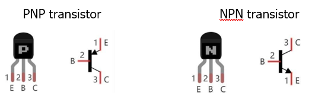
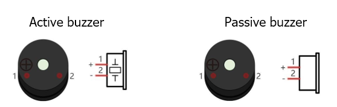
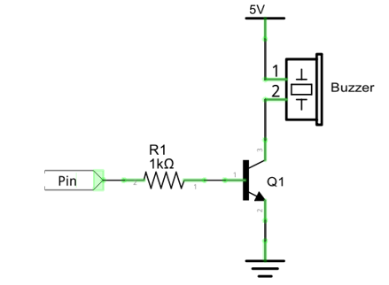
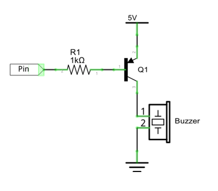
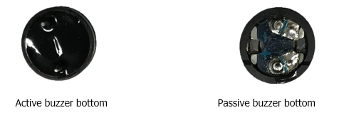
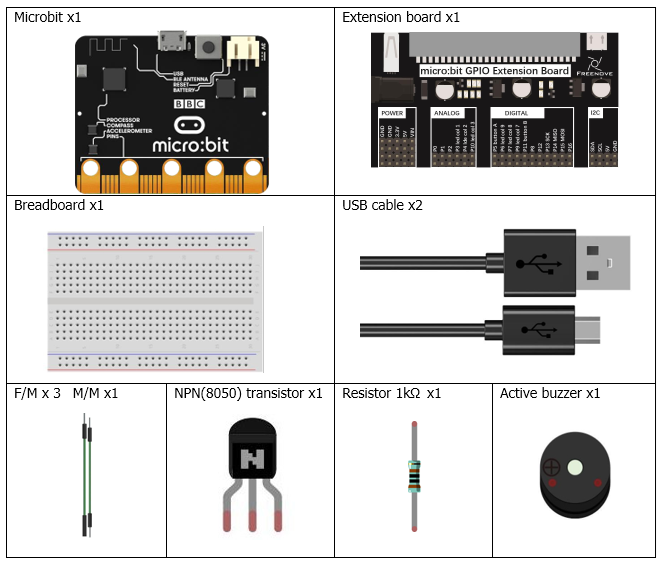
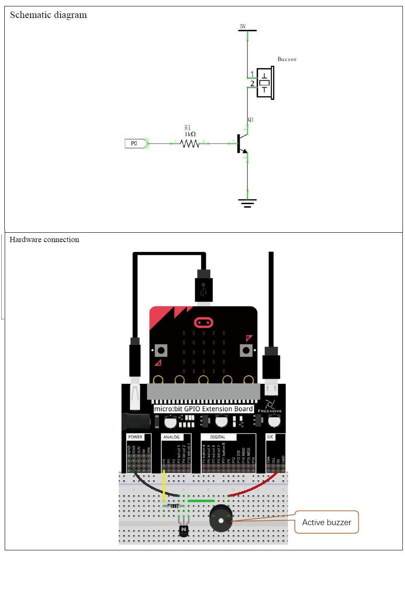
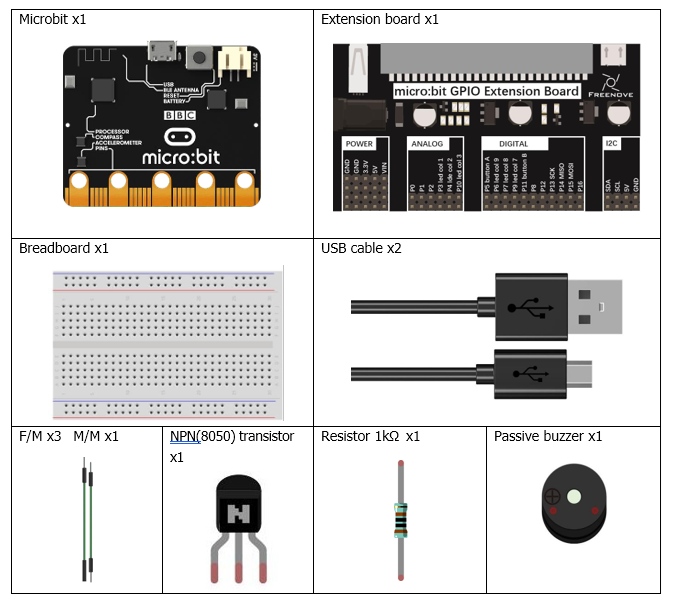
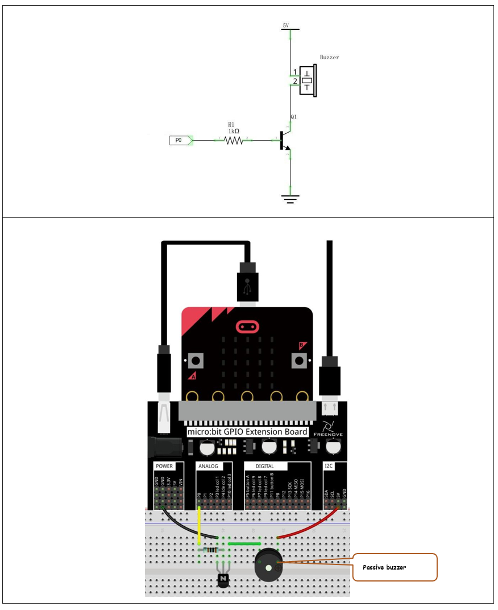

# Capítulo 9 - Buzzer
En este capítulo, aprenderemos qué son los zumbadores y qué sonidos emiten. Hay dos tipos de zumbadores (buzzer): los activos y los pasivos.

## Conociendo los componentes
### Transistor
En este proyecto se necesita un transistor debido a que la corriente del zumbador es tan elevada que la capacidad de salida del GPIO de la RPi no puede satisfacer los requisitos de potencia necesarios para su funcionamiento. Se necesita un transistor NPN para amplificar la corriente.

Los transistores, cuyo nombre completo es "transistor semiconductor", son dispositivos semiconductores que controlan la corriente (piensa en un transistor como un "dispositivo electrónico de amplificación o conmutación"). Los transistores pueden utilizarse para amplificar señales débiles o para funcionar como interruptores. Los transistores tienen tres electrodos (pines): base (b), colector (c) y emisor (e). Cuando circula corriente entre "b", la corriente en "c" se multiplica varias veces (amplificación del transistor); en esta configuración, el transistor actúa como amplificador. Cuando la corriente generada por "b" supera un determinado valor, "c" limitará la corriente de salida. En este punto, el transistor funciona en su región de saturación y actúa como un interruptor. Existen dos tipos de transistores, tal y como se muestra a continuación:

<p style="text-align: center;">
    
</p>

> Nota: En nuestro kit, el transistor PNP lleva la referencia 8550 y el transistor NPN, la referencia 8050.
> 
>Gracias a sus características, los transistores se utilizan a menudo como interruptores en circuitos digitales. Dado que la capacidad de salida de corriente de los microcontroladores es muy baja, utilizaremos un transistor para amplificar su corriente y poder alimentar componentes que requieran una corriente mayor.

### Buzzer
Un zumbador es un componente acústico. Se utilizan ampliamente en dispositivos electrónicos como calculadoras, despertadores electrónicos, indicadores de averías de automóviles, etc. Existen zumbadores tanto activos como pasivos. Los zumbadores activos cuentan con un oscilador en su interior y suenan mientras reciben alimentación eléctrica. Los zumbadores pasivos requieren una señal de oscilador externa (que suele utilizar PWM con diferentes frecuencias) para emitir un sonido.

<p style="text-align: center;">
    
</p>

>Nota: El buzer activo tiene una etiqueta blanca pegada en su parte superior, mientras que el buzer pasivo no tiene ninguna etiqueta.

Los zumbadores activos son más fáciles de usar. Por lo general, solo emiten una frecuencia de sonido específica. Los buzzers pasivos requieren un circuito externo para emitir sonidos, pero pueden controlarse para que emitan sonidos de diversas frecuencias. La frecuencia de resonancia del pasivo de este kit es de 2 kHz, lo que significa que suena más fuerte cuando su frecuencia de resonancia es de 2 kHz.

El zumbador requiere una gran cantidad de corriente cuando funciona. Sin embargo, por lo general, el puerto del microcontrolador no puede proporcionar la corriente suficiente para ello. Para controlar el buzzer a través del micro:bit, se puede utilizar un transistor para accionarlo de forma indirecta.

Cuando utilizamos un transistor NPN para accionar un zumbador, solemos emplear el siguiente método: si el GPIO emite un nivel alto, la corriente fluirá a través de R1 (resistencia 1), el transistor conducirá la corriente y el buzzer emitirá un sonido. Si el GPIO emite un nivel bajo, no fluirá corriente a través de R1, el transistor no conducirá corriente y permanecerá en silencio (sin emitir ningún sonido).

<p style="text-align: center;">
    
</p>

Cuando utilizamos un transistor PNP para controlar un zumbador, solemos emplear el siguiente método. Si el GPIO emite un nivel bajo, la corriente fluirá a través de R1. El transistor conduce la corriente y el zumbador emitirá un sonido. Si el GPIO emite un nivel alto, no fluirá corriente a través de R1, el transistor no conducirá corriente y el zumbador permanecerá en silencio (no emitirá ningún sonido). 

<p style="text-align: center;">
    
</p>

### Como identificar los buzzer activos de los pasivos
1.    Por regla general, los zumbadores activos llevan una etiqueta que cubre el orificio por donde se emite el sonido, aunque hay excepciones a esta regla.
2.    Los buzzers activos son más complejos que los pasivos en cuanto a su fabricación. En su interior hay numerosos circuitos y osciladores de cristal; todo ello suele estar protegido con un recubrimiento impermeable (y una carcasa), de modo que solo quedan al descubierto los pines de la parte inferior. Por otro lado, los zumbadores pasivos no tienen recubrimientos protectores en su parte inferior. Desde los orificios de las patillas, al observar un buzzer pasivo, se puede ver la placa de circuito, las bobinas y un imán permanente (todos estos componentes o cualquier combinación de ellos, dependiendo del modelo).

<p style="text-align: center;">
    
</p>

## Descripción del proyecto 9.1
En este proyecto, utilizaremos un zumbador activo para reproducir una melodía fija.

### Hardware necesario
<p style="text-align: center;">
    
</p>

### Esquema de conexión
#### Diagrama esquemático

<p style="text-align: center;">
    
</p>

### Código fuente
> El pin a usar es: P0.
>
>Se nombra como RING0.
>
> Se corresponde con: P0.02.
>
> En Rust: board.edge.e00,

``` rust
{{#include src/main.rs}}
```
``` shell
cargo run
``` 

#### Explicación del código
Al ser un buzzer activo, no es necesario generar una señal PWM para que emita un sonido. Por lo tanto, el código es muy sencillo. En este proyecto, el zumbador se activa durante 100 microsegundos y luego se apaga durante el mismo tiempo en un bucle de cuatro vueltas. Este proceso se repite indefinidamente tras esperar medio segundo.

## Descripción del proyecto 9.2 (Reproducción de Cumpleaños Feliz)
En este proyecto, utilizaremos un zumbador pasivo para reproducir la melodía de "Cumpleaños Feliz".

### Hardware necesario
<p style="text-align: center;">
    
</p>

### Esquema de conexión
#### Diagrama esquemático

<p style="text-align: center;">
    
</p>

### Código fuente
> El pin a usar es: P0.
>
>Se nombra como RING0.
>
> Se corresponde con: P0.02.
>
> En Rust: board.edge.e00,

``` rust
{{#include examples/happy_birthday.rs}}
```
``` shell
cargo run --example happy_birthday
``` 

#### Explicación del código
> **Nota:** En el fichero **docs/musictunes.c** encontramos datos de las notas musicales y sus frecuencias usados en el proyecto micropython. En el proyecto Rust, se han usado como base.

La programación usa el método de onda PWM para generar la señal de sonido como en el capítulo 7. La frecuencia de la señal PWM determina el tono del sonido emitido por el zumbador. En este proyecto, se definen las notas musicales y sus frecuencias correspondientes, y se utiliza un bucle para reproducir la melodía de "Cumpleaños Feliz" mediante la activación y desactivación del zumbador a las frecuencias adecuadas.
