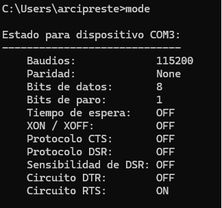
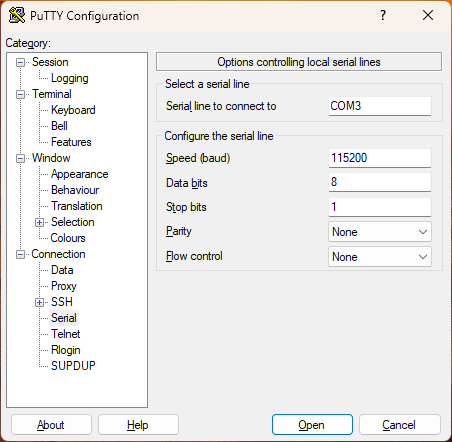
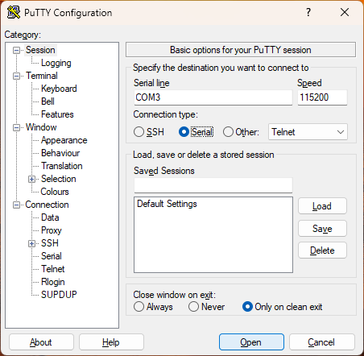
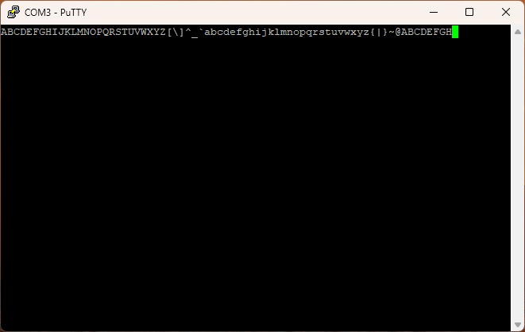

# Capítulo 10 - Comunicación serie
## Conexión con un dispositvo serie
Lo más cercano a un estándar universal de E/S para las placas embebidas modernas es el “puertoserie”. Prácticamente, todos los microcontroladores tienen una forma de hacer que algunos de suspines actúen como un puerto serie, y prácticamente todas las placas de microcontroladores hacenque estos pines sean fáciles de acceder. La MB2 no es una excepción.

El puerto de comunicaciones serie es asíncrono en el sentido de que ninguna de las líneas compartidas lleva una señal de reloj. En cambio, ambas partes deben acordar cómo de rápido seenviarán los datos a través del cable antes de que ocurra la comunicación. Un periférico llamado Universal Asynchronous Receiver/Transmitter (UART) envía bits a la velocidad especificada en su línea de salida y espera la llegada de los bits en su línea de entrada.

El protocolo de comunicación serie funciona con tramas, cada una transporta un byte de datos. Cada trama tiene un bit de inicio, de 5 a 9 bits de datos de carga útil (enviados en formato lsb a msb; las aplicaciones actuales rara vez utilizan el tamaño de 9 bits; los bytes de 7 o menos bits en unatrama se rellenarán a la izquierda hasta un byte de 8 bits con ceros) y 1 o 2
bits de parada. Cada byte enviado se interpreta como un carácter ASCII, y la mayoría de los sistemas operativos modernos tienen un controlador de terminal que puede mostrar estos caracteres en una ventana de terminal.

Los ordenadores actuales no suelen tener un puerto serie, e incluso si lo tienen, el voltaje queutilizan (+5V en uno moderno, ±12V en un RS-232 antiguo) está fuera del rango que el hardware dela MB2 acepta y puede dañarlo. No podemos conectar directamente el ordenador al microcontrolador.

Tanto Linux como windows incorporan emuladores que simular puertos serie sobre puertos USB. En Linux, el emulador de puerto serie se llama ttyUSB0, y en Windows se llama COMx, donde x es un número que depende del ordenador y del puerto USB que se esté utilizando.

### Datos de conexión
Para acceder a los datos usamos en un terminal windows la orden
``` shell'
mode
```
<p style="text-align: center;">
    
</p>

### Instalación de putty
Es necesario instalar un emulador de terminal, en este caso se usará putty, que es un cliente SSH y telnet gratuito. Se puede descargar desde el siguiente enlace: [https://www.putty.org/](https://www.putty.org/)

Abriremos Putty y pulsaremos en la opción Serial en el submenú **Connection**, en el campo Serial line pondremos el puerto COM que nos ha asignado windows, en este caso COM3, y en Speed pondremos 115200, que es la velocidad de transmisión de datos. Quitaremos el control de flujo (Flow control).

<p style="text-align: center;">
    
</p>

A continuación, seleccionaremos el submenú **Session** de la parte izquierda y activaremos la option **Serial**, pulsaremos el botón **Open** para abrir la conexión con la MB2. Si todo ha ido bien, se abrirá una ventana de terminal, ver imagen al final del capítulo.

<p style="text-align: center;">
    
</p>

> La conexión debe estar establecida antes de la ejecución del programa.

## Descripción del proyecto
Este proyecto utiliza puertos serie para transmitir y mostrar datos.

### Hardware necesario
<p style="text-align: center;">
    
</p>

### Esquema de conexión
#### Diagrama esquemático

<p style="text-align: center;">
    
</p>

### Código fuente
> Se usará el dispostivo UART para la comunicación serie.

``` rust
{{#include src/main.rs}}
```
``` shell
cargo run
``` 

#### Explicación del código
Primero creamos la conexión con el dispositivo UART, a continuación realizamos un blucle para enviar desde la MB2 al ordenador los asscii desde el 65 a 127, se deberán mostrar en la ventana de terminal del ordenador de forma indefinida.

<p style="text-align: center;">
    
</p>
