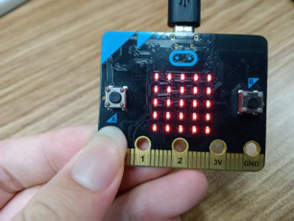
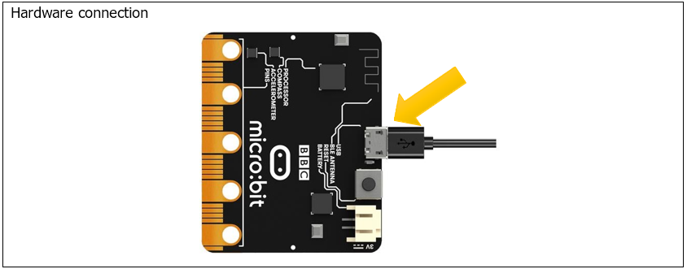
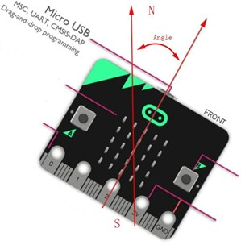
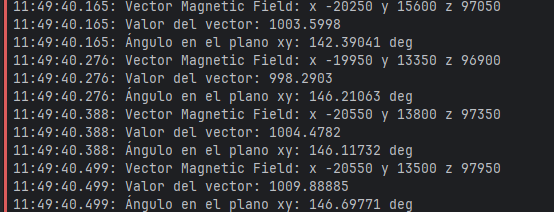
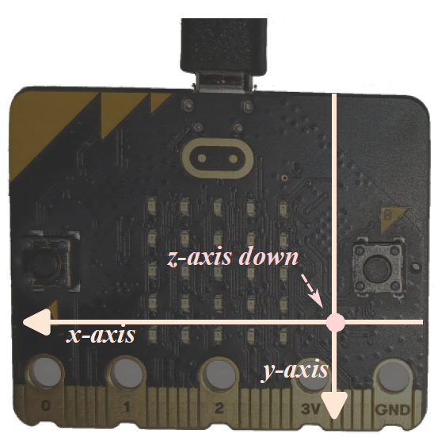
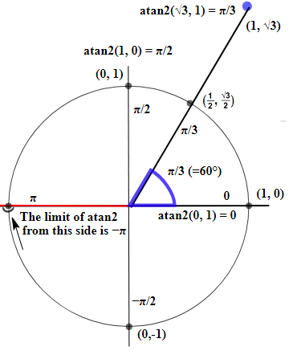
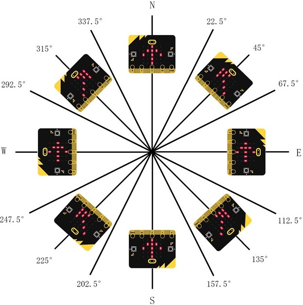

# Capítulo 11 - Magnetómetro
## Protocoo i2C
El protocolo I2C es un acrónimo de Inter-Integrated Circuit o Circuito Inter-Integrado. Es unprotocolo de comunicación en serie síncrona que utiliza dos líneas para intercambiar datos: unalínea de datos (SDA) y una línea de reloj (SCL). La línea de reloj se utiliza para sincronizar lacomunicación. La comunicación en serie síncrona puede funcionar más rápido y de manera másfi able que la comunicación en serie asincrónica. Los dispositivos I2C tienen
direcciones de bus la implementación de hardware permite enviar bytes a un elemento en particular, mientras que otros conectados a los mismos cables ignoran esta comunicación.

## Conociendo los componentes
### LSM303AGR
Los sensores de movimiento en el micro:bit, el magnetómetro y el acelerómetro, están empaquetados en un solo componente: el circuito integrado LSM303AGR. Estos dos sensores sepueden acceder a través de un bus I2C. Cada sensor se comporta como un dispositivo I2C y tiene una dirección diferente.
Cada sensor tiene su propia memoria donde almacena los resultados de la detección de su entorno. Nuestra interacción con estos sensores consistirá principalmente en leer su memoria.

La memoria de estos sensores se modela como registros direccionables por bytes. Estos sensores también se pueden configurar; eso se hace escribiendo en sus registros. Entonces, en cierto sentido, estos sensores son muy similares a los periféricos de dentro del microcontrolador. La diferencia es que sus registros no están mapeados en la memoria del microcontrolador. En su lugar, sus registros deben accederse a través del bus I2C.

### Protocolo I2C de lectura
Si el controlador quiere leer datos del destino:
1. **Controlador**: Emite un Broadcast START.
2. **Controlador**: Emite la dirección del dispositivo destino (7 bits) + el bit de R/W (8th) establecido a READ.
3. **Dispositivo**: Responde un ACK (ACKnowledgement).
4. **Dispositivo**: Envía un byte.
5. **Controlador**: Responde con un ACK.
6. Se repiten los pasos 4 y 5 cero o más veces.
7. **Controlador**: Emite un Broadcast STOP, o comienza otra transacción de lectura.

> *NOTA*: La dirección del destino puede tener 10 bits en vez de 7 bits. No cambiaría nada más.

Muchos dispositivos I2C están organizados internamente como si tuvieran “registros de dispositivo”, cada uno con una dirección de 8 bits y un contenido de 8 bits. Normalmente, los registros se escriben con una escritura de dos bytes: el primer byte es la dirección del registro y el segundo elnuevo valor del registro.
Una operación denominada “combinada” o “dividida” puede consistir en una escritura en el destino seguida de una lectura inmediata del mismo. Normalmente, los registros del dispositivo se leen de esta manera: se escribe la dirección del registro y, a continuación, se lee inmediatamente el valor actual de dicho registro.

### Acceso a los datos
No tendría sentido implementar un driver para el LSM303AGR para cada plataforma que Rustembebido soporta (y nuevas que podrían aparecer). Para evitar esto, se puede escribir un driver que utilice tipos genéricos que implementen traits para proporcionar una versión de driver independiente de la plataforma. Afortunadamente, para nosotros esto ya se ha hecho en el crate lsm303agr.
Por lo tanto, leer los valores reales del acelerómetro y del magnetómetro será básicamente una experiencia plug and play (además de leer un poco de documentación). De hecho, la página de crates.io ya nos proporciona todo lo que necesitamos saber para leer datos del acelerómetro, pero usando una Raspberry Pi. Solo tendremos que adaptarlo a nuestro chip.

## Descripción del proyecto 11.1
Este proyecto mostrará en la consola los datos obtenidos del chip del magnetómetro.

Es necesario calibrar el magnetómetro. La calibración del magnetómetro hará que el programa se detenga hasta que finalice el proceso. El proceso de calibración será el primero, y nuestra labor es que rotando la MB2 en todas las direcciones posibles, se enciendan todos los leds.

<p style="text-align: center;">
    
</p>


### Hardware necesario
<p style="text-align: center;">
    
</p>

### Esquema de conexión
#### Diagrama esquemático

<p style="text-align: center;">
    
</p>

### Código fuente
> se usará el protocolo I2C para leer los datos del magnetómetro y mostrarlos en la consola mediante el crate lsm303agr.

``` rust
{{#include src/main.rs}}
```
``` shell
cargo run
``` 

#### Explicación del código
El desplazamiento angular es el ángulo entre las direcciones del micro:bit y el Polo Norte geográfico, tal y como se muestra en la siguiente figura.

<p style="text-align: center;">
    
</p>

En un primer paso definimos todos los dispositivos necesarios y calibramos el magnetómetro. En un segundo paso, obtenemos los datos del magnetómetro, mostramos los valores según el plano, el valor del módulo del vectoy y el ángulo con respecto al plano xy con valores de -180 a 180 grados.

<p style="text-align: center;">
    
</p>

## Descripción del proyecto 11.2
En esta sección, vamos a implementar una brújula usando los LEDs del MB2. Como las brújulasnormales, la nuestra debe apuntar hacia el norte. Esto lo haremos al encender uno de sus LEDs; el LED encendido debe apuntar hacia el norte.

Los campos magnéticos tienen tanto una magnitud, medida en Gauss o Teslas, como una dirección .El magnetómetro del MB2 mide tanto la magnitud como la dirección de un campo magnético externo, pero la información de campo la presenta descomponiéndola en sus ejes proporcionando tres valores.

<p style="text-align: center;">
    
</p>

El polo norte magnético de la Tierra es algo caprichoso: difiere del norte verdadero en la mayoría delos lugares de la Tierra, a veces de forma considerable. Cambia con el tiempo. Si no se tiene en cuenta todo esto, no se obtendrá una brújula muy precisa, aunque el magnetómetro de la MB2 seaperfecto (que no lo es). Esta calculadora de la NOAA de EE.UU (
https://www.ngdc.noaa.gov/geomag/calculators/mobileDeclination.shtml)
nos da una estimación delpolo norte real así como del magnético; Se puede introducir en esta calculadora
del BGS (http://www.geomag.bgs.ac.uk/data_service/models_compass/wmm_calc.html) del Reino Unido nuestra latitud, longitud y altitud para obtener tanto la declinación como la inclinación magnética. En mi ubicación, la “declinación” (diferencia entre el norte verdadero y el nortemagnético) es de unos 0,73º; la “inclinación” es de unos sorprendentes 55,4º hacia el interior de la Tierra.

Vamos a usar algo de matemáticas para conseguir el ángulo exacto del campo magnético a partir de los ejes X e Y del magnetómetro. Esto nos permitirá averiguar qué LED apunta al norte.
Usaremos la función atan2 de Rust. Esta función devuelve el ángulo en el rango de -PI a PI. El gráfico a continuación muestra cómo se mide este ángulo:

<p style="text-align: center;">
    
</p>

Aunque no se muestra explícitamente, en este gráfico el eje X apunta hacia la derecha y el eje Y apunta hacia arriba. Hay que tener en cuenta que nuestro sistema de coordenadas está girado 180° con respecto a este.

### Hardware necesario
El mismo que en el proyecto anterior.

### Esquema de conexión
#### Diagrama esquemático
El mismo que en el proyecto anterior.


### Código fuente
> se usará el protocolo I2C para leer los datos del magnetómetro mediante el crate lsm303agr.

``` rust
{{#include examples/brujula.rs}}
```
``` shell
cargo run --example brujula
``` 

#### Explicación del código
Tras todas las definiciones de dispositivos y la calibración del magnetómetro creamos la martriz que indicará qué led encender en función del angulo, recordar que hay que utilizar una fila y una columna para encender un led y mandar los datos de todos los leds en una matriz al display.

Después, en un bucle infinito, obtenemos los datos del magnetómetro, calculamos el ángulo 

```rust
        let theta = atan2f(y as f32, x as f32);
```

Para evitar enalazar 16 condicionales para comprobar rangos de ángulos, se crean 16 regiones de 22,5 grados cada una, y se asigna a cada región un led, a contnuación en función del ángulo se usa la región correspondiente.

<p style="text-align: center;">
    
</p>


```rust
        let seg = floorf(16.0 * theta / PI) as i8;

        let index = if seg >= 15 || seg <= -15 {
            8
        } else if seg >= 0 {
            (seg / 2) as usize
        } else {
            ((31 + seg) / 2) as usize
        };
```

> **Nota**: En realidad se crean 32 y se usan dos adyacentes para cada dirección.