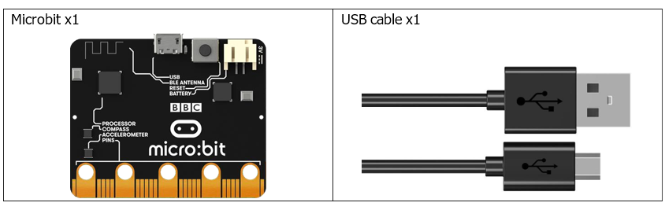
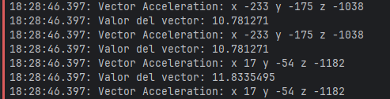

# Capítulo 12 - Acelerómetro

## Descripción del proyecto 12.1
En este proyecto, obtendremos datos del sensor acelerómetro y los mostraremos en la consola serie.

### Hardware necesario
<p style="text-align: center;">
    
</p>

### Esquema de conexión
#### Diagrama esquemático

<p style="text-align: center;">
    
</p>

### Código fuente
> se usará el protocolo I2C para leer los datos del magnetómetro y mostrarlos en la consola mediante el crate lsm303agr.

``` rust
{{#include src/main.rs}}
```
``` shell
cargo run
``` 

#### Explicación del código
El código es similar al capítulo anterior, pero en este caso se leerán los datos del acelerómetro y se mostrarán en la consola serie. A continuación se muestra una imagen de los resultados.

<p style="text-align: center;">
    
</p>

## Descripción del proyecto 12.2
En este proyecto, utilizaremos el acelerómetro para fabricar un nivel.

### Hardware necesario
El mismo que en el proyecto anterior.

### Esquema de conexión
#### Diagrama esquemático
El mismo que en el proyecto anterior.

### Código fuente
> se usará el protocolo I2C para leer los datos del magnetómetro mediante el crate lsm303agr.

``` rust
{{#include examples/nivel.rs}}
```
``` shell
cargo run --example nivel
``` 

#### Explicación del código
Leeremos el valor del acelerómetro en las direcciones de los ejes X e Y. El rango de valores devueltos es de -2000 a 2000. Este proyecto no requiere un rango tan amplio, por lo que lo utilizamos rango de -400 a 400. Llamamos a la función mapping() para devolver un valor comprendido entre 0 y 4, encendiendo el LED correspondiente a la fila x y la columna y.

> Creamos una función `mapping()` personalizada limita el valor de salida a un intervalo de 0 a 4