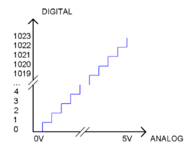
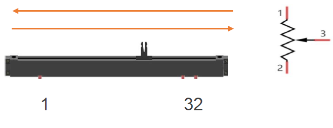
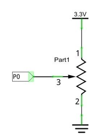
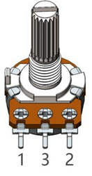
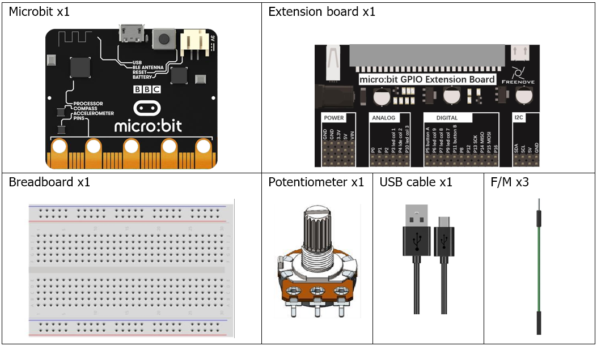
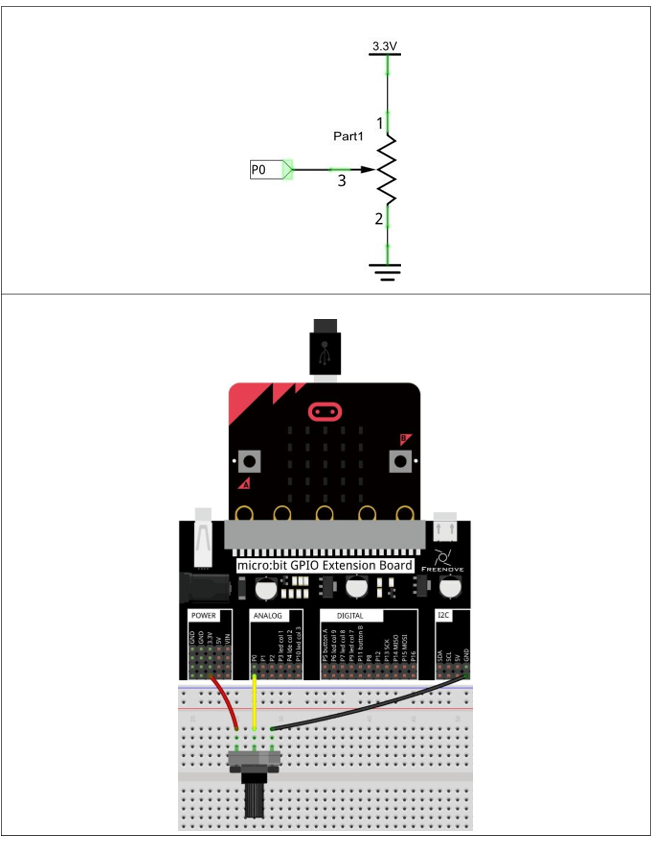

# Capítulo 13 - Potenciómetro


## Descripción del proyecto 
Este proyecto permite que un potenciómetro giratorio genere diferentes tensiones.

### Conociendo los componentes
#### ADC
Un ADC es un circuito integrado electrónico que se utiliza para convertir señales analógicas, como tensiones, a formato digital o binario, compuesto por unos y ceros. El rango de nuestro módulo ADC es de 10 bits, lo que significa que la resolución es de 2^10 = 1024, de modo que su rango (a 3,3 V) se dividirá en 1024 partes iguales.
Cualquier valor analógico puede asignarse a un valor digital utilizando la resolución del convertidor. Por lo tanto, cuantos más bits tenga el ADC, más densa será la división del valor analógico y mayor será la precisión de la conversión resultante.

<p style="text-align: center;">
    
</p>

- Subsección 1: la señal analógica en el rango de 0 V-3,3/1024 V corresponde al 0 digital; 
- Subsección 2: la señal analógica en el rango de 3,3/1024 V-2*3,3/1024 V corresponde al 1 digital;

La señal analógica resultante se dividirá en consecuencia.

#### Potenciómetro
Un potenciómetro es un elemento resistivo con tres terminales. A diferencia de las resistencias que hemos utilizado hasta ahora en nuestro proyecto, que tienen un valor de resistencia fijo, el valor de resistencia de un potenciómetro se puede ajustar. Un potenciómetro suele estar compuesto por un material resistivo (un alambre o un elemento de carbono) y un cursor móvil. Cuando el cursor se desplaza a lo largo del elemento resistivo, se produce un cambio en la resistencia del lado de salida del potenciómetro (3) (o un cambio en la tensión del circuito del que forma parte). La ilustración siguiente muestra un potenciómetro deslizante lineal y, a la derecha, su símbolo electrónico.

<p style="text-align: center;">
    
</p>

Entre los pines 1 y 2 del potenciómetro se encuentra el elemento resistivo (un hilo resistivo o de carbón) y el pin 3 está conectado a la escobilla que entra en contacto con el elemento resistivo. En nuestra ilustración, cuando el cepillo se desplaza del pin 1 al pin 2, el valor de la resistencia entre el pin 1 y el pin 3 aumentará linealmente (hasta alcanzar el valor máximo del elemento resistivo) y, al mismo tiempo, la resistencia entre el pin 2 y el pin 3 disminuirá linealmente y, a la inversa, hasta llegar a cero. En el punto medio del deslizador, los valores de resistencia medidos entre los pines 1 y 3 y entre los pines 2 y 3 serán iguales.
En un circuito, ambos extremos del elemento resistivo suelen conectarse a los electrodos positivo y negativo de la fuente de alimentación. Al deslizar la escobilla por el «pin 3», se puede obtener una tensión variable dentro del rango de la fuente de alimentación.

<p style="text-align: center;">
    
</p>

#### Potenciómetro giratorio
Los potenciómetros giratorios y los potenciómetros lineales tienen la misma función; la única diferencia radica en que el movimiento físico es giratorio en lugar de deslizante.

<p style="text-align: center;">
    
</p>

### Hardware necesario
<p style="text-align: center;">
    
</p>

### Esquema de conexión
#### Diagrama esquemático

<p style="text-align: center;">
    
</p>

### Código fuente
> Se usará el períférico ADC para leer el valor del potenciómetro y mostrarlo en la consola. Recordar que no todos los pines se pueden leer de forma analógica, por lo que se debe usar el pin P0.02 para la lectura del potenciómetro.

``` rust
{{#include src/main.rs}}
```
``` shell
cargo run
``` 

#### Explicación del código
El periférico encargado de las lecturas analógicas en la MB2 se llama SAADC (Successive Approximation Analog-to-Digital Converter) y en el crate se accede con **board.ADC**.

En primer lugar se configuran todos los periféricos necesarios para la lectura del potenciómetro, en este caso el periférico ADC y el pin P0.02. A continuación, se realiza la lectura del valor analógico del potenciómetro y se muestra en la consola. Se hace una conversión entre el valor numérico y la tensión correspondiente. La tensión se calcula con la siguiente fórmula:

```
tension = (valor_analogico / ( 0.33  * 2^14 )
```
Para finalizar se pausa el programa durante 1 segundo antes de realizar la siguiente lectura.