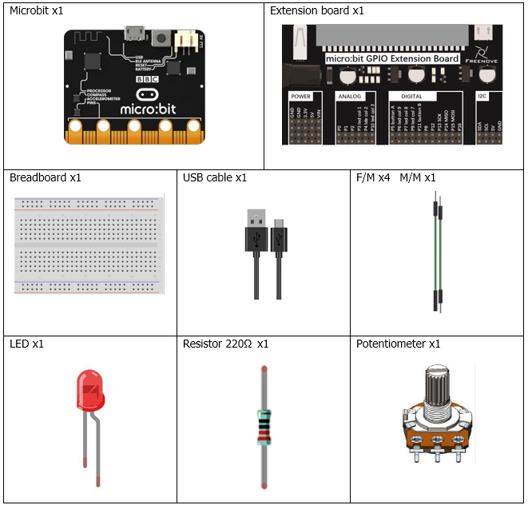
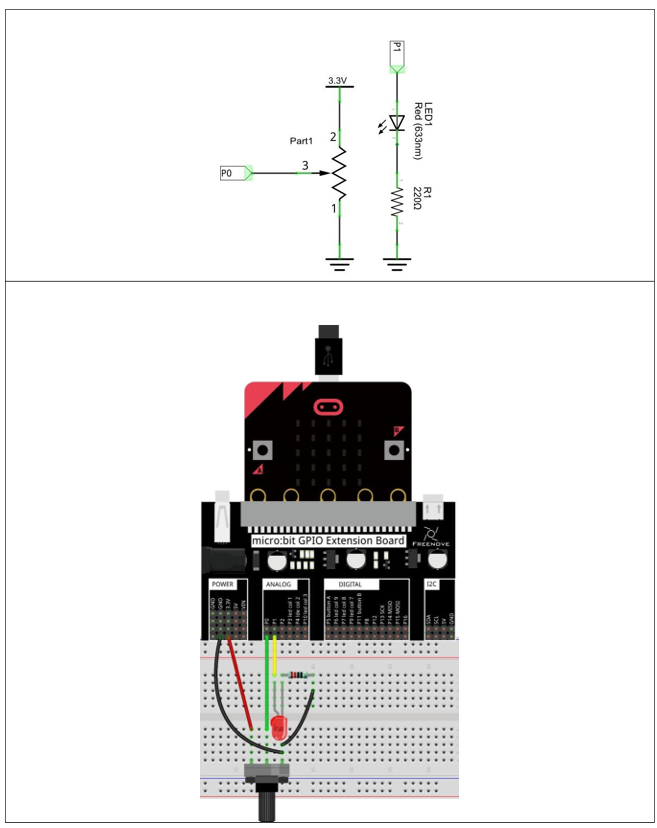
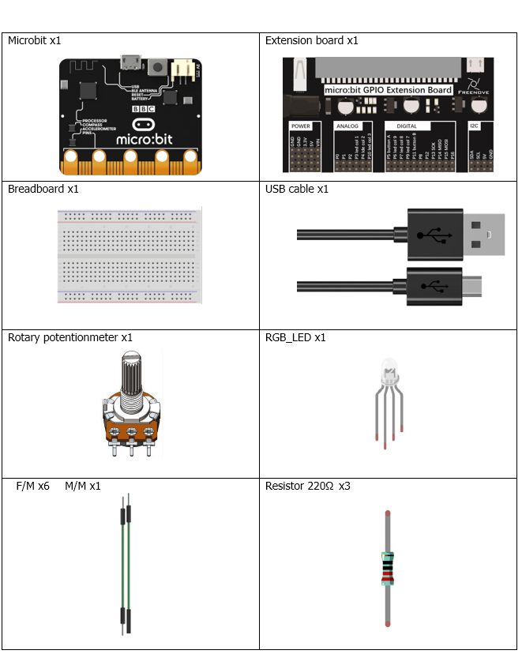
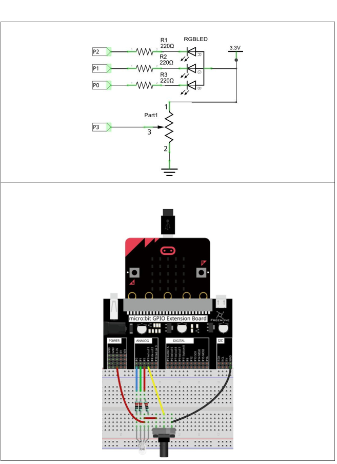
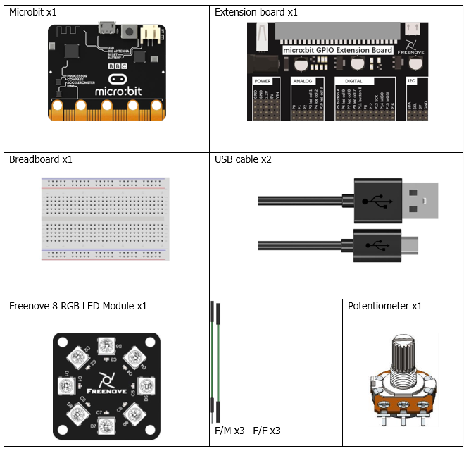
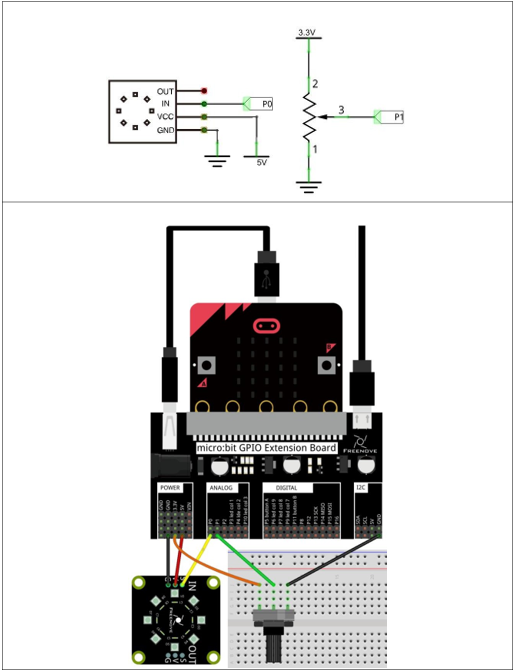

# Capítulo 14 - Potenciómetro y Led


## Descripción del proyecto 14.1: Soft Light
En este proyecto, construiremos un LED con brillo regulable.

### Hardware necesario
<p style="text-align: center;">
    
</p>

### Esquema de conexión
#### Diagrama esquemático

<p style="text-align: center;">
    
</p>


> **NOTA**: Conexión del hardware
> En este circuito, los terminales 1 y 2 del potenciómetro están conectados, respectivamente, a los dos extremos de la fuente de alimentación, y el terminal 3 está conectado al pin P0 del micro:bit.
> 
> El pin P1 está conectado al terminal largo del LED (positivo), y su terminal corto (negativo) está conectado a la resistencia.


### Código fuente
> Se usará el períférico ADC para leer el valor del potenciómetro y mostrarlo en la consola. Recordar que no todos los pines se pueden leer de forma analógica, por lo que se debe usar el pin P0.02 (P0 de la expansión) para la lectura del potenciómetro.

``` rust
{{#include src/main.rs}}
```
``` shell
cargo run
``` 

#### Explicación del código
La primera parte del código es simmilar a la del proyecto anterior, donde se inicializa el periférico ADC y se configura el pin P0 como entrada analógica. Luego, en un bucle infinito, se lee el valor del potenciómetro y se ajusta el brillo del LED en consecuencia.

A coninuación se configura el pin P1 como salida tal y como se hacía en proyectos anteriores. Este proyecto se puede interpretar cmo la unión del proyecto 3 y del 13.

Dentro del bucle simplemente leemos del potenciómetro, ajustamos el valor al rango máximo del led de aproximadamente 32 Khz y se escribe el valor en el pin P1 para ajustar el brillo del LED.

## Descripción del proyecto 14.2: Multicolored Soft Light
En este proyecto, controlamos el color del LED RGB mediante un potenciómetro.

### Hardware necesario
<p style="text-align: center;">
    
</p>

### Esquema de conexión
#### Diagrama esquemático

<p style="text-align: center;">
    
</p>

> **NOTA**: El pin largo (ánodo) del RGBLED debe estar conectado a una fuente de alimentación de 3,3 V.

### Código fuente
> Los pines a usar son: P0, P1, P2, P3
>
>Se nombran como RING0, RING1, RING2, COL3
>
> Se corresponden con: P0.02, P0.03, P0.04, P0.31.
>
> En Rust: board.edge.e00, board.edge.e01, board.edge.e02, board.display_pins.col3.

Usamos el Pin por poder leer de forma analógica el potenciómetro, y los otros pines para controlar el color del LED RGB.

``` rust
{{#include examples/rgb_led.rs}}
```

``` shell
cargo run --example rgb_led
``` 

#### Explicación del código
En la primera parte configuramos el pin P3 para entrada de forma anlaógica, esto desconecta dicha línea de la matriz led de la MB2 **board.display_pins.col3.into_floating_input()**. A coninuación, configuramos los pines P0, P1 y P2 como salidas para controlar el color del LED RGB (Ver capítulo 7 para una explicacion más detallada).

El bucle lee un valor del potenciómetro, lo convierte a otro valor entre 0 y 359º para el color HLS, y luego se transforma a RGB para finalmente escribirlo en los pines del LED RGB.

En últinma instancia, esperamos 200 ms para evitar cambio excesivo de color.

## Descripción del proyecto 14.3: Rainbow Light
En este proyecto, utilizamos un potenciómetro para controlar el módulo LED RGB.

### Hardware necesario
<p style="text-align: center;">
    
</p>

### Esquema de conexión
#### Diagrama esquemático

<p style="text-align: center;">
    
</p>


### Código fuente
> Los pines a usar son: P0, P1
>
>Se nombran como RING0, RING1
>
> Se corresponden con: P0.02, P0.03.
>
> En Rust: board.edge.e00, board.edge.e01.

Usaremos P1 para leer de forma analógica el potenciómetro y P0 para controlar la ruleta de leds.

> **Nota**: Recordar cambiar el fichero Cargo.toml. 
> 
>Las versiones deben ser **microbit-v2 = "0.15.1"**  y **[dependencies.nrf52833-hal] version = "0.18.0"**
> 
> Es un problema con la implementación de la librería **smart_leds**.

``` rust
{{#include examples/rainbow.rs}}
```

``` shell
cargo run --example rainbow
``` 

#### Explicación del código
Para un mayor detalle del uso de los leds visitar el capítulo 8. Elcódigo es sencillo, tras las configuraciones de todos los dispositivos, leemos el valor del potenciómetro 8 veces para los 8 leds, los convertimos a RGB y almacenamos en la matriz temporal. Una vez leidos, se mandan al periférico para que se muestren, esperando un tiempo prudencial para volver a realizar la lectura.

