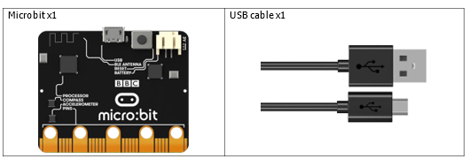
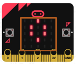
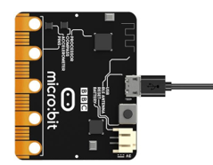
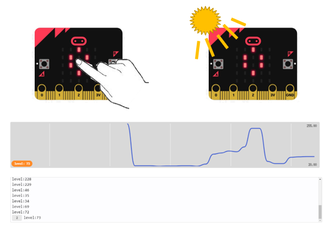
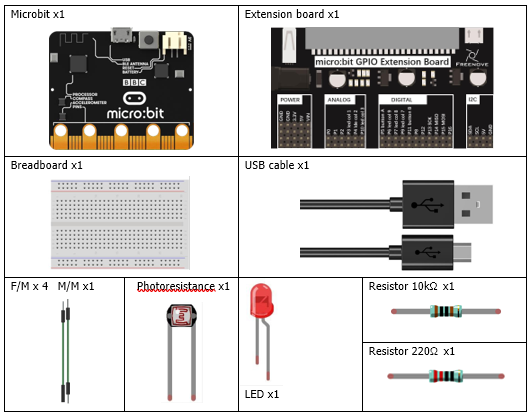
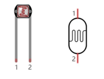
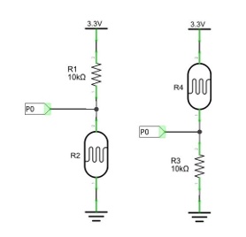
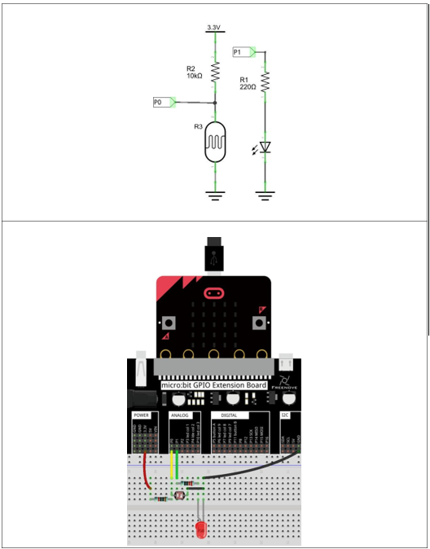
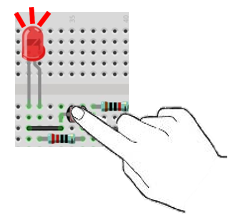

# Capítulo 15 - Sensor de luz

## Descripción del proyecto 15.1: Sensor de Luz
En este proyecto, utilizamos el sensor de luz integrado en el micro:bit para medir la intensidad de la luz.
### Hardware necesario
<p style="text-align: center;">
    
</p>

### Conociendo los componentes
#### Sensor de luz
La Micro:bit detecta la intensidad de la luz ambiental a través de la matriz de LED. En el modo de polarización directa, la pantalla de LED funciona como una pantalla de visualización. En el modo de polarización inversa, la pantalla de LED funciona como un sensor de luz básico que puede utilizarse para detectar la luz ambiental.

La MB2 utiliza la fila superior de la matriz de LED (fila 1) exclusivamente para la detección de luz. Esto significa que el código debe utilizar la fila 1 (row1) y al pin de la columna correspondiente
(como la columna 1 (col1)) para crear la polarización inversa.

<p style="text-align: center;">
    
</p>

### Esquema de conexión
#### Diagrama esquemático

<p style="text-align: center;">
    
</p>


### Código fuente

Tapa la pantalla LED con la mano o aumenta la luz que incide sobre ella; podrás observar el cambio en el valor. El rango de valores es de 0 a 255: 0 corresponde a la oscuridad y 255 al máximo brillo, tal y como se muestra a continuación.

<p style="text-align: center;">
    
</p>

``` rust
{{#include src/main.rs}}
```
``` shell
cargo run
``` 

#### Explicación del código
El código establece la matriz de LED en modo de polarización inversa y luego lee el valor del sensor de luz. El valor se muestra en la consola. En este caso, como ejemplo, se muestrean 256 valores (8 bits).

Probar a poner una linterna cerca de los leds y sin ella, ser verá como cambian los valores impresos.

## Descripción del proyecto 15.2: night light
En este proyecto, vamos a fabricar una luz nocturna.

### Hardware necesario
<p style="text-align: center;">
    
</p>

### Conociendo los componentes
#### Photoresistor
Una fotorresistencia es, sencillamente, una resistencia sensible a la luz. Se trata de un componente activo cuya resistencia disminuye a medida que recibe luminosidad (luz) en su superficie sensible a la luz. El valor de la resistencia de una fotorresistencia variará en proporción a la luz ambiental detectada. Gracias a esta característica, podemos utilizar una fotorresistencia para detectar la intensidad de la luz. A continuación se muestran la fotorresistencia y su símbolo electrónico.

<p style="text-align: center;">
    
</p>

El circuito que se muestra a continuación se utiliza a menudo para detectar la variación del valor de la resistencia de una fotorresistencia:

<p style="text-align: center;">
    
</p>

En el circuito anterior, cuando el valor de la resistencia de una fotorresistencia cambia debido a una variación en la intensidad de la luz, la tensión entre la fotorresistencia y la resistencia R1 también cambia. Por lo tanto, la intensidad de la luz se puede obtener midiendo esta tensión.

### Esquema de conexión
#### Diagrama esquemático
<p style="text-align: center;">
    
</p>

### Código fuente
> Usaremos el P0 como entrada del sensor de luz y el P1 como salida del LED.
 
Comprueba la conexión del circuito, asegúrate de que sea correcta y descarga el código en el micro:bit. Tapa la fotorresistencia con la mano y el LED se encenderá. Retira la mano y el LED se apagará.

<p style="text-align: center;">
    
</p>


``` rust
{{#include examples/night_light.rs}}
```

``` shell
cargo run --example night_light
``` 

#### Explicación del código
Configurando el P0 como entrada analógica del fotoresistor y P1 como salida digital del led, cuando el valor sea menor que 400 encenderá. Se muestrean 1024 valores (10 bits).
