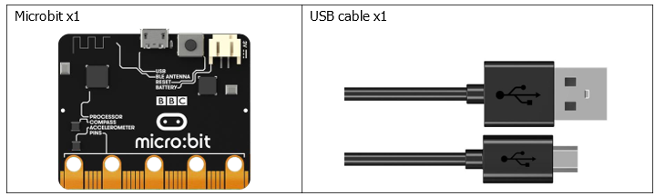
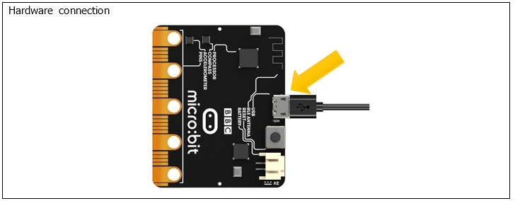
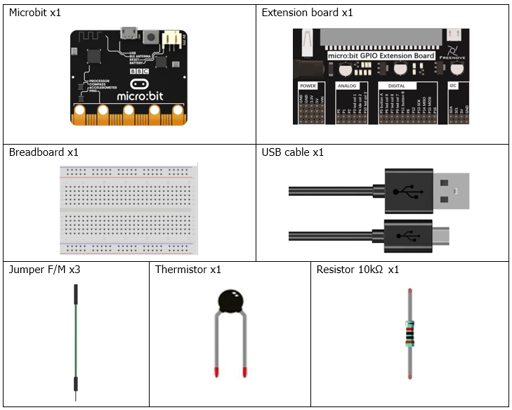
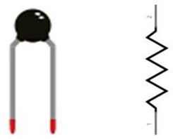
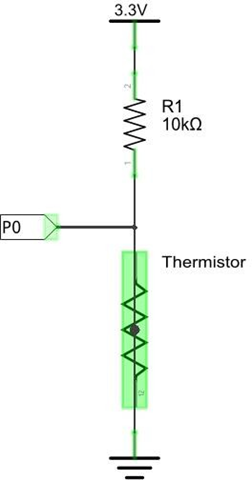
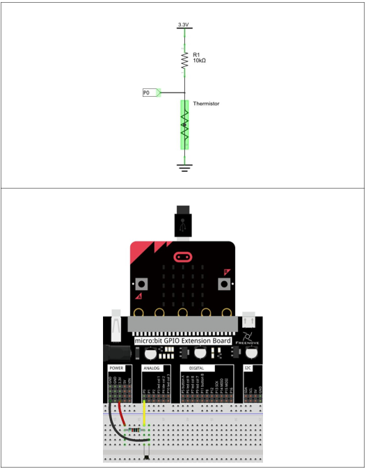

# Capítulo 16 - Sensor de temperatura

## Descripción del proyecto 16.1: Sensor de temperatura
En este proyecto, medimos la temperatura con el sensor de temperatura integrado en el micro:bit.

### Hardware necesario
<p style="text-align: center;">
    
</p>

### Conociendo los componentes
#### Sensor de temperatura
El sensor interno del nRF52 mide la temperatura del chip del procesador, lo que sirve como una aproximación de la temperatura del aire ambiente, en lugar de una lectura directa del termómetro de la habitación.

### Esquema de conexión
#### Diagrama esquemático

<p style="text-align: center;">
    
</p>


### Código fuente
``` rust
{{#include src/main.rs}}
```


``` shell
cargo run
``` 

#### Explicación del código
>  El hardware de nRF52 devuelve el valor multiplicado por 4 (en pasos de 0.25 °C)
> Es importante esta línea en el fichero Cargo.toml, cualquier versión posterior indica que deberíamos hacer uso de interrupciones. **embassy-nrf = { version = "0.2.0", features = ["nrf52833"] }**.

Lo nuevo aparece en esta función:
``` rust
fn read_temperature_raw(temp_regs: &nrf52833_pac::TEMP) -> i32 {
    temp_regs.tasks_start.write(|w| unsafe { w.bits(1) });
    while temp_regs.events_datardy.read().bits() == 0 {
        core::hint::spin_loop();
    }
    temp_regs.events_datardy.write(|w| unsafe { w.bits(0) });
    temp_regs.temp.read().bits() as i32
}
``` 
Las tres primeras líneas inicializan el sensor para una lectura corecta, la última devuelve el valor de temperatura en pasos de 0.25 °C, por lo que para obtener la temperatura en °C se tiene que dividir entre 4.

El programa también incluye una función que admite un valor entero y lo muestra desplazándose por la pantalla LED del micro:bit. La función `show_integer_con_desplazamiento`.

## Descripción del proyecto 16.2: Termistor
En este proyecto, utilizaremos un termistor para detectar la temperatura ambiente.

### Hardware necesario
<p style="text-align: center;">
    
</p>

### Conociendo los componentes
#### Termistor
Un termistor es una resistencia sensible a la temperatura. Cuando detecta un cambio de temperatura, la resistencia del termistor varía. Podemos aprovechar esta característica utilizando un termistor para detectar la intensidad de la temperatura. A continuación se muestra un termistor y su símbolo electrónico.

<p style="text-align: center;">
    
</p>

La relación entre el valor de la resistencia y la temperatura de un termistor es:
**rt = R * EXP[B * (1/T2 - 1/T1)]**
Donde:
**rt** es la resistencia del termistor a la temperatura T2;
**R** es la resistencia nominal del termistor a la temperatura T1;
**EXP[n]** es la enésima potencia de e;
**B** es el índice térmico;
**T1** y **T2** son temperaturas en kelvin (temperatura absoluta). Temperatura en kelvin = **273,15 + temperatura en grados Celsius**.
Para los parámetros del termistor, utilizamos: B = 3950, R = 10 k, T1 = 25.
El método de conexión del termistor en el circuito es similar al de la fotorresistencia, tal y como se muestra a continuación:

<p style="text-align: center;">
    
</p>

Podemos utilizar el valor medido por el pin analógico del micro:bit para obtener el valor de la resistencia del termistor y, a continuación, aplicar la fórmula para calcular la temperatura.
Por lo tanto, la fórmula para calcular la temperatura se puede derivar de la siguiente manera:
**T2 = 1/(1/T1 + ln(rt/R)/B)**

### Esquema de conexión
#### Diagrama esquemático
<p style="text-align: center;">
    
</p>

### Código fuente
> Usaremos el P0 como entrada del sensor de temperatura.

``` rust
{{#include examples/termistor.rs}}
```

``` shell
cargo run --example termistor
``` 

#### Explicación del código
Es similar al visto en la unidad anterior. La mayor complejidad es el cálculo de temperatura y se explica en la sección de conociendo el hardware.
