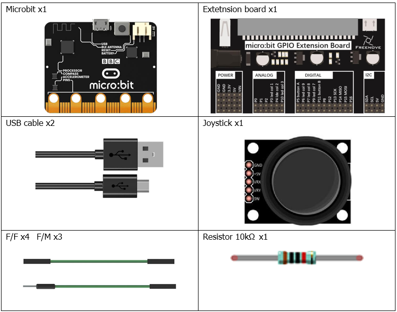
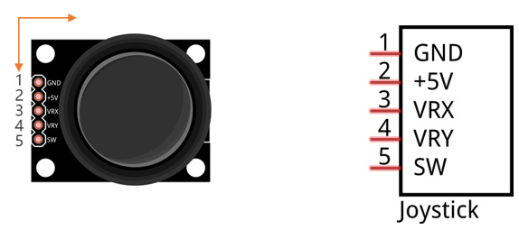
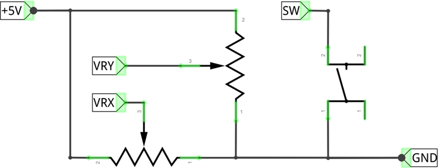
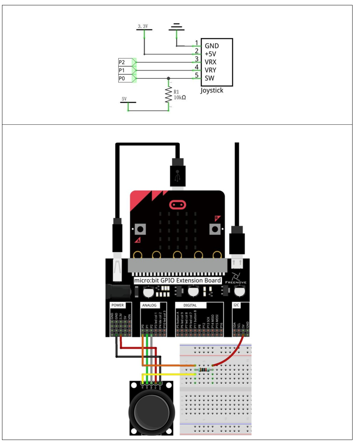
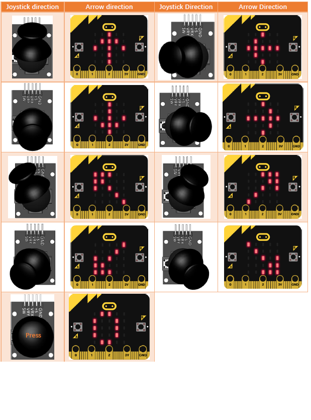

# Capítulo 17 - Joystick
En un capítulo anterior, aprendimos a utilizar el potenciómetro giratorio. Ahora vamos a aprender qué son los joysticks, que son módulos electrónicos que funcionan según el mismo principio que el potenciómetro giratorio.

## Descripción del proyecto 17.1: Visualización de los datos del joystick
En este proyecto, leeremos los datos de salida de un joystick y los mostraremos en pantalla.

### Hardware necesario
<p style="text-align: center;">
    
</p>

### Conociendo los componentes
#### Joystick
Un joystick es un tipo de sensor de entrada que se maneja con los dedos. Seguramente ya estés familiarizado con este concepto, ya que se utilizan mucho en mandos de videojuegos y mandos a distancia. Puede recibir entradas en dos ejes (Y y/o X) al mismo tiempo (lo que suele utilizarse para controlar la dirección en un plano bidimensional). Además, permite controlar una tercera dirección al pulsar hacia abajo (eje Z/dirección).

<p style="text-align: center;">
    
</p>

Esto se consigue incorporando dos potenciómetros giratorios en el interior del módulo del joystick, situados a 90 grados entre sí, colocados de tal manera que detecten cambios de dirección en dos direcciones simultáneamente, y con un interruptor de botón en el eje «vertical», que puede detectar cuándo el usuario pulsa el joystick.

<p style="text-align: center;">
    
</p>

### Esquema de conexión
#### Diagrama esquemático

<p style="text-align: center;">
    
</p>


### Código fuente
``` rust
{{#include src/main.rs}}
```

``` shell
cargo run
``` 

#### Explicación del código
>  Usamos los pines P0, P1 y P2 para leer los valores de salida del joystick. El pin P2 se utiliza para leer el eje X, el pin P1 para leer el eje Y y el pin P0 para leer el botón pulsador.

La lectura de Z se hace en digital, ya que es un pulsador, la de los ejes X e Y se hace en analógico.

## Descripción del proyecto 17.2: Mostrar la dirección
<p style="text-align: center;">
    
</p>

### Hardware necesario
El mismo que en el proyecto anteior.

### Esquema de conexión
#### Diagrama esquemático
El mismo que en el proyecto anteior.

### Código fuente
> La misma configuración que en el proyecto anterior.

``` rust
{{#include examples/showing_direction.rs}}
```

``` shell
cargo run --example showing_direction
``` 

#### Explicación del código
Se leen los tres valores y en función de ellos se muestra la dirección adecuada. Si no hay desplazamiento, la pantalla se queda en blanco. Si se pulsa se mostrará un cero.

La función `show_arrow` se encarga de mostrar la dirección en la pantalla.
