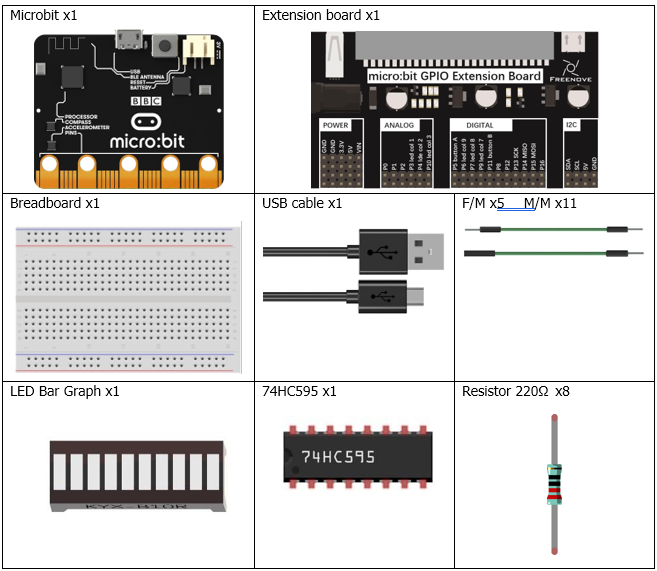
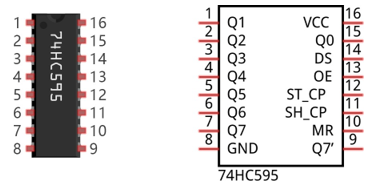
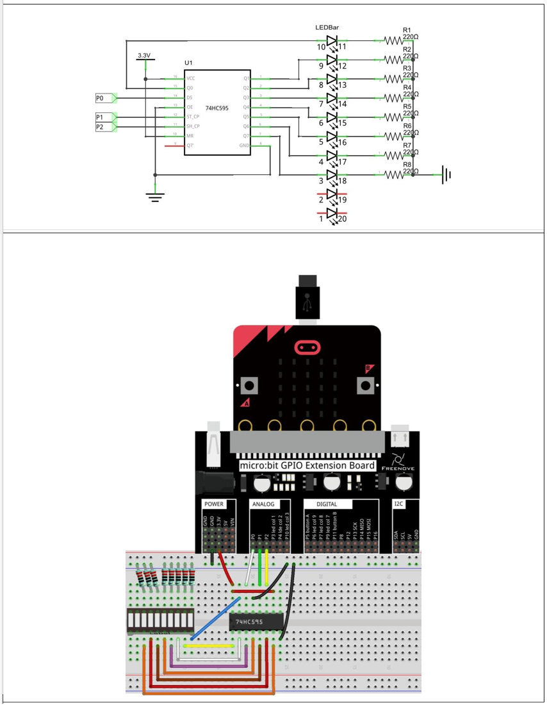

# Capítulo 18 - LED Bar Graph
## Descripción del proyecto 18.1: Luz de agua que fluye
En este proyecto, utilizaremos un chip 74HC595 y una barra gráfica de LED para crear una luz que simule el flujo del agua.

### Hardware necesario
<p style="text-align: center;">
    
</p>

### Conociendo los componentes
#### 74HC595
Se utiliza un chip 74HC595 para convertir datos en serie en datos en paralelo. Un chip 74HC595 puede convertir los datos en serie de un byte en 8 bits y enviar el nivel correspondiente a cada uno de los 8 puertos. Gracias a esta característica, el chip 74HC595 se puede utilizar para ampliar los puertos de E/S. Se necesitan al menos 3 puertos de la placa MB2 para controlar los 8 puertos del chip 74HC595.

<p style="text-align: center;">
    
</p>

Los puertos del 74HC595 se describen de la siguiente manera:

| Nombre del pin | Número de pin | Descripción                                                                                                                                                                             |
|:---------------|:--------------|:----------------------------------------------------------------------------------------------------------------------------------------------------------------------------------------|
| **Q0-Q7**      | 15, 1-7       | Salida de datos en paralelo.                                                                                                                                                            |
| **VCC**        | 16            | El electrodo positivo de la fuente de alimentación; la tensión es de 2 a 6 V.                                                                                                           |
| **GND**        | 8             | El electrodo negativo de la fuente de alimentación.                                                                                                                                     |
| **DS**         | 14            | Entrada de datos en serie.                                                                                                                                                              |
| **OE**         | 13            | Salida de habilitación: cuando este pin está en nivel alto, Q0-Q7 se encuentra en estado de alta resistencia; cuando este pin está en nivel bajo, Q0-Q7 se encuentra en modo de salida. |
| **ST_CP**      | 12            | Salida de actualización en paralelo: cuando su nivel eléctrico está en subida, actualiza la salida de datos en paralelo.                                                                |
| **SH_CP**      | 11            | Reloj de desplazamiento en serie: cuando su nivel eléctrico está en aumento, el registro de entrada de datos en serie realiza un desplazamiento.                                        |
| **MR**         | 10            | Borrado del registro de desplazamiento: cuando este pin está en nivel bajo, se borra el contenido del registro de desplazamiento.                                                       |
| **Q7'**        | 9             | Salida de datos en serie: se puede conectar en serie a más 74HC595.                                                                                                                     |
### Esquema de conexión
#### Diagrama esquemático
> **Nota**: Si la barra LED no funciona, prueba a girarla 180°.

<p style="text-align: center;">
    
</p>


### Código fuente
``` rust
{{#include src/main.rs}}
```

``` shell
cargo run
```

#### Explicación del código
>  Configuramos el pin de datos del 74HC595 como P0, el pin de lanzamiento como P1 y el pin de reloj como P2.

En el bucle "for", el valor de la variable "value" se desplaza i bits hacia la izquierda; a continuación, dicho valor se escribe en el 74HC595 y, finalmente, se encienden los LEDs uno a uno a través de la salida paralela de Q0-Q7 para simular el efecto de agua que fluye.

La función "write_byte" implementa el protocolo de transmisión, ver conociendo los componentes para más detalles.