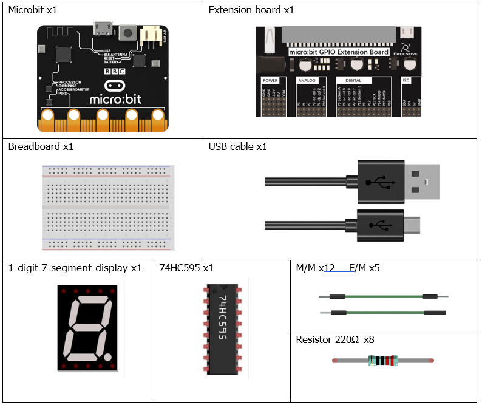
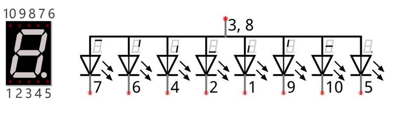
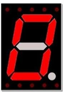
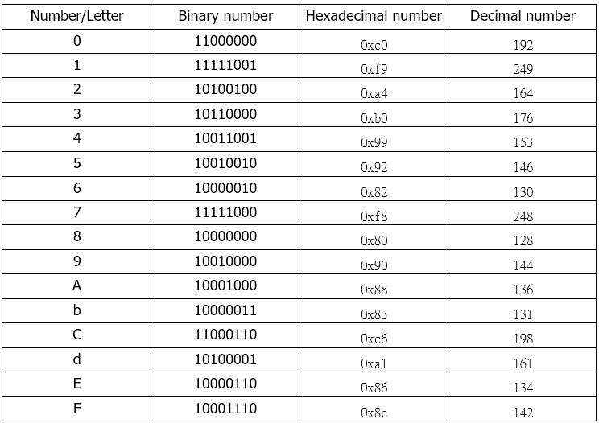
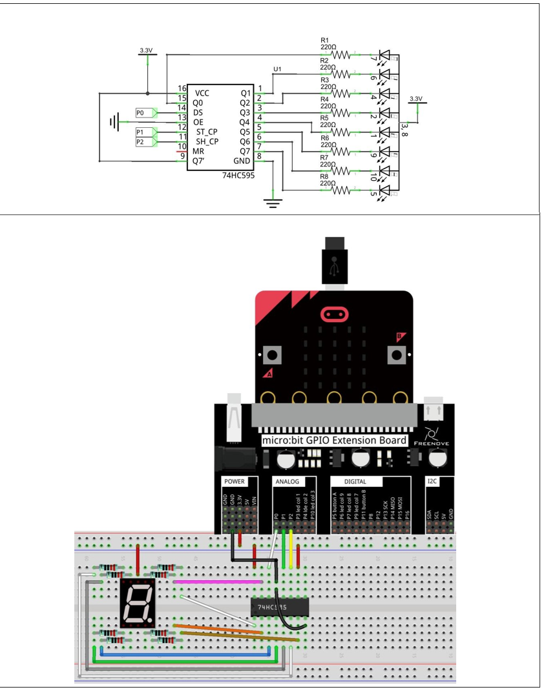

# Capítulo 19 - Display de segmentos
## Descripción del proyecto 19.1: Display de segmentos de 7 LED
En este proyecto, utilizaremos un chip 74HC595 y un display de 7 segmentos LED para mostrar los números 0 al 9.

### Hardware necesario
<p style="text-align: center;">
    
</p>

### Conociendo los componentes
#### Display de 7 segmentos
Una pantalla de 7 segmentos es un dispositivo de visualización electrónico digital. Muestra el número «8» y un punto decimal, y está compuesta por 8 LED. Existen dos tipos de pantallas de 7 segmentos de un dígito: las de ánodo común y las de cátodo común. La que utilizamos es la que tiene un ánodo común (+) y cátodos individuales. A continuación se muestra su estructura interna y el diagrama de asignación de pines:

<p style="text-align: center;">
    
</p>

Como podemos ver en el esquema del circuito anterior, podemos controlar el estado de cada LED por separado. Además, al combinar LED con diferentes estados (encendido y apagado), podemos mostrar distintos caracteres (números y letras). Por ejemplo, para mostrar un «0», tenemos que encender los segmentos de LED 7, 6, 4, 2, 1 y 9, y apagar los segmentos de LED 10 y 5.

<p style="text-align: center;">
    
</p>

Si utilizamos un byte para indicar el estado de los LED conectados a los pines 5, 10, 9, 1, 2, 4, 6 y 7, podemos usar el 0 para representar el estado «encendido» y el 1 para «apagado». Así, el número 0 se puede expresar como el número binario 11000000, es decir, el hexadecimal 0xc0.

A continuación se muestran los números y las letras que se pueden visualizar:

<p style="text-align: center;">
    
</p>

### Esquema de conexión
#### Diagrama esquemático
> **Nota**: Haynque fijarse bien en la posición del punto del led.

<p style="text-align: center;">
    
</p>


### Código fuente
``` rust
{{#include src/main.rs}}
```

``` shell
cargo run
```

#### Explicación del código
>  Configuramos el pin de datos del 74HC595 como P0, el pin de lanzamiento como P1 y el pin de reloj como P2.

En el bucle "for", recorremos los valores del array para mostrar los valores correspondientes.

La función "write_byte" implementa el protocolo de transmisión, ver conociendo los componentes para más detalles.
