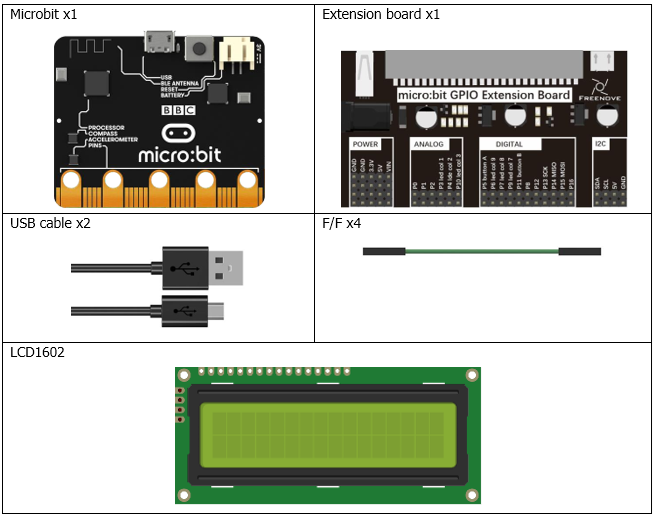
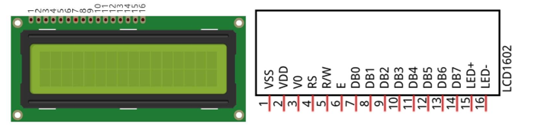
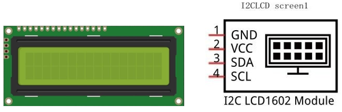
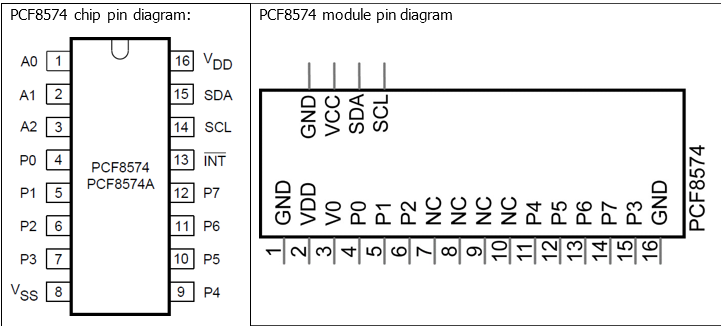
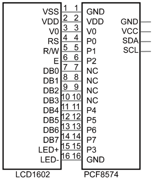
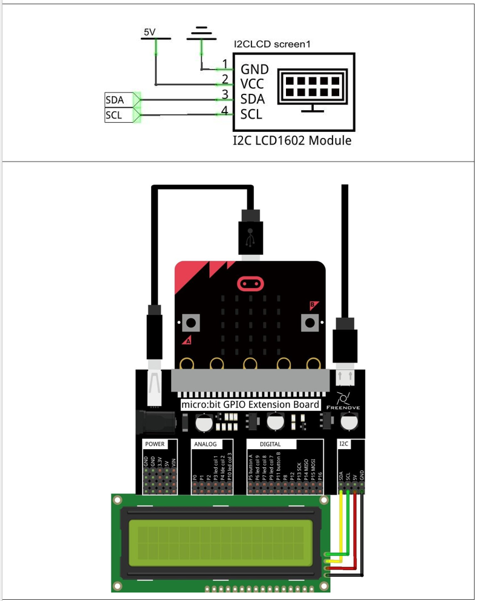
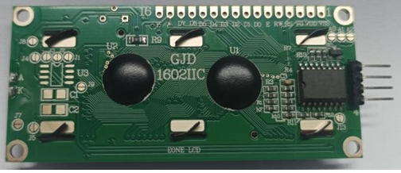
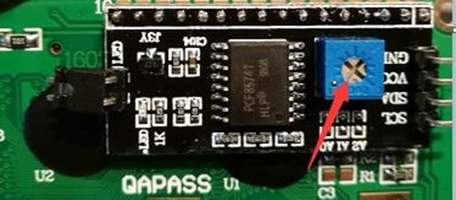

# Capítulo 20 - Display LCD 1602
## Descripción del proyecto 20.1: Display LCD 1602
En este proyecto, utilizaremos un display LCD 1602 para mostrar información en la pantalla.

### Hardware necesario
<p style="text-align: center;">
    
</p>

### Conociendo los componentes
#### Display LCD 1602
> Patillaje del módulo de expansión I2C para LCD1602:
> 
> P19 -> SCL (Reloj I2C)
> 
> P20 -> SDA (Datos I2C)
> 
> GND -> GND
> 
> 3V / External Power -> VCC (Nota: Muchas pantallas LCD de 16x2 requieren 5V para que el contraste se vea correctamente;
> Si es el caso, alimenta el LCD a través del módulo de expansión).


La pantalla LCD1602 puede mostrar 2 líneas de caracteres en 16 columnas. Es capaz de mostrar números, letras, símbolos, código ASCII, etc. A continuación se muestra una pantalla LCD1602 monocromática junto con el diagrama de pines de su circuito.

<p style="text-align: center;">
    
</p>

La pantalla LCD1602 I2C integra una interfaz I2C, que conecta el módulo de entrada serie y salida paralela a la pantalla LCD1602. Esto nos permite utilizar solo 4 líneas para hacer funcionar la pantalla LCD1602.

<p style="text-align: center;">
    
</p>

El circuito integrado de conversión de serie a paralelo utilizado en este módulo es el PCF8574T (PCF8574AT), y su dirección I2C por defecto es 0x27 (o 0x3F).

Diagrama de pines del PCF8574:

<p style="text-align: center;">
    
</p>

Los pines del módulo PCF8574 y los del LCD1602 se corresponden y están conectados entre sí:

<p style="text-align: center;">
    
</p>

Por este motivo, tal y como se ha mencionado anteriormente, solo necesitamos 4 pines para controlar los 16 pines de la pantalla LCD1602 a través de la interfaz I2C.
En este proyecto, utilizaremos I2CLCD1602 para mostrar algunos caracteres estáticos y variables dinámicas.


### Esquema de conexión
#### Diagrama esquemático
<p style="text-align: center;">
    
</p>


### Código fuente
``` rust
{{#include src/main.rs}}
```

``` shell
cargo run
```

#### Explicación del código
>  Usaremos el canal i2c externo para la comunicación con la pantalla lcd.
> El crate a utilizar es 'i2c-character-display = "0.5.2"' y el dispositivo 'CharacterDisplayPCF8574T'.

Hasta el momento, en el momento de redactar este artículo, tenemos a la venta dos tipos de LCD1602. En uno hay que ajustar la retroiluminación, mientras que en el otro no es necesario.
El LCD1602 en el que no es necesario ajustar la retroiluminación se muestra en la siguiente figura.

<p style="text-align: center;">
    
</p>

Si el LCD1602 que hemos recibido es el que se muestra a continuación y no se ve nada en la pantalla o la imagen no es nítida, probaremos a girar lentamente el mando blanco situado en la parte trasera, que sirve para ajustar el contraste, hasta que la imagen se vea con claridad.

<p style="text-align: center;">
    
</p>

Inicialización de la pantalla LCD: ofrecemos dos tipos de pantallas LCD; se puede introducir la dirección I2C (0x27 o 0x3F) según la pantalla LCD que se reciba, en caso de no utilizar una dirección el crate buscará automáticamente en ambas.

En mi caso es la primera versión, por lo que lo primero es poner el brillo en **on** una vez inicializada la pantalla, a continuación nos posicionamos en la primera línea y primer carácter para imprimir el mensaje, pasamos a la segunda línea y mostramos el segundo texto. Dentro del bulce recorremos los valores del 0 al 9 de forma infinita, mostrándolos de forma que no se borren los textos anteriores.

#### Ampliación
Modificar el código para leer la temperatura del sensor interno de la placa (capítulo 16) y mostrarlo en la pantalla led.