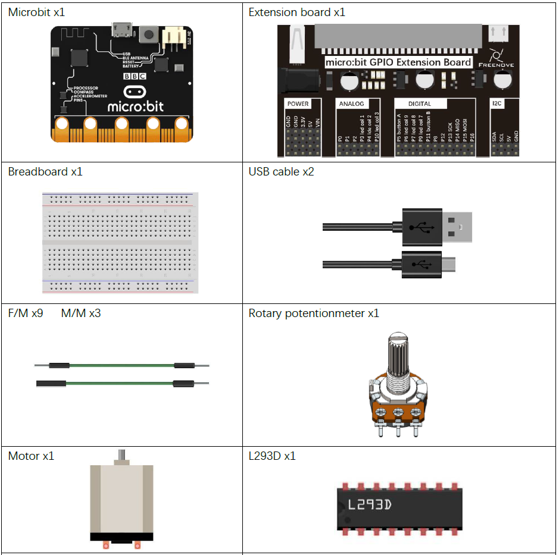
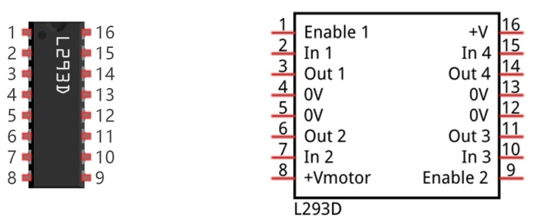
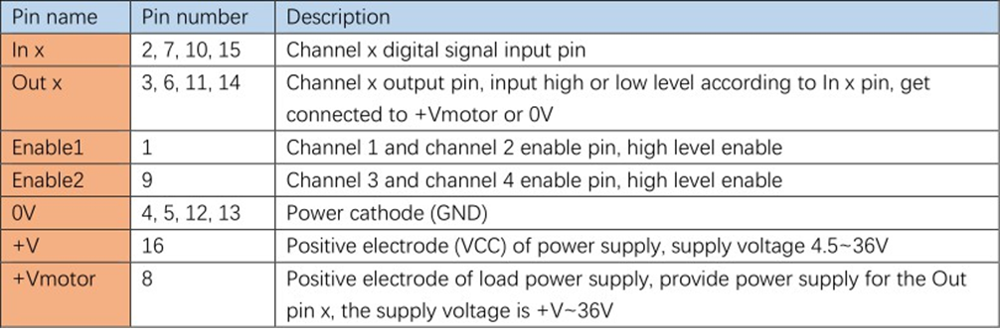
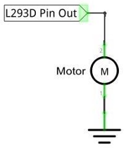
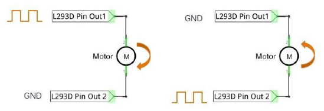
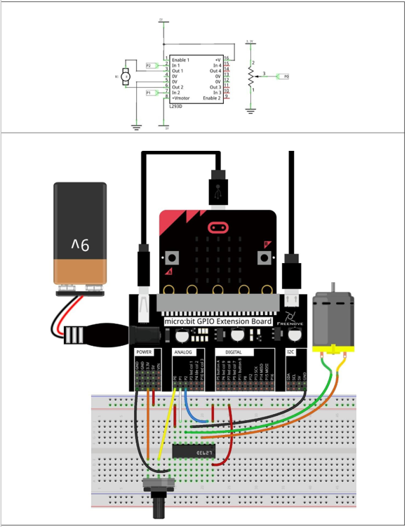

# Capítulo 21 - Motor
## Descripción del proyecto 21.1: Potenciómetro y motor
En este proyecto se utiliza un potenciómetro giratorio para controlar un motor.

### Hardware necesario
<p style="text-align: center;">
    
</p>

### Conociendo los componentes
#### L293D
El L293D es un chip IC (circuito integrado) con un controlador de motor de 4 canales. Permite controlar un motor de corriente continua unidireccional mediante 4 puertos, un motor de corriente continua bidireccional mediante 2 puertos o un motor paso a paso (los motores paso a paso se tratan más adelante en este tutorial).

<p style="text-align: center;">
    
</p>

La descripción de los puertos del módulo L293D es la siguiente:
<p style="text-align: center;">
    

</p>

Cuando se utiliza el L293D para controlar un motor de corriente continua, suelen existir dos opciones de conexión.
La siguiente opción de conexión utiliza un canal del L239D, que puede controlar la velocidad del motor mediante PWM; sin embargo, en ese caso el motor solo puede girar en una dirección.

<p style="text-align: center;">
    
</p>

La siguiente conexión utiliza dos canales del L239D: un canal emite la onda PWM y el otro se conecta a GND. De este modo, se puede controlar la velocidad del motor. Al intercambiar las señales de estos dos canales, no solo se controla la velocidad del motor, sino que también se puede regular la velocidad del motor.

<p style="text-align: center;">
    
</p>

En la práctica, el motor suele conectarse al canal 1 y, al enviar diferentes niveles a in1 e in2, se controla el sentido de giro del motor; además, al enviar una señal de onda PWM al puerto "Enable1", se controla la velocidad de giro del motor. Si el motor está conectado a los canales 3 y 4, se envían diferentes niveles a «in3» e «in4» para controlar el sentido de giro del motor, y se envía una señal PWM al pin "Enable2" para controlar la velocidad de giro del motor.


### Esquema de conexión
#### Diagrama esquemático
<p style="text-align: center;">
    
</p>


### Código fuente
> Si no funciona correctamente, probar a girar 180º el circuito integrado L239D.
> 
> Los Pines a usar van a ser P0, P1 y P2. P0 para la lectura del potenciómetro ( capítulo 13) y P1 y P2 para los dos extremos del motor y así poder controlar la dirección del giro.

``` rust
{{#include src/main.rs}}
```

``` shell
cargo run
```

#### Explicación del código
Clomo queremos simular una salida analógica, utilizaremos los dos puertos PWM de la placa, uno para cada pin así como dos canales diferentes.

Configuramos la lectura analógica en 1024 valores (10 bits) y creamos on una condición tres zonas. Mover izquierda (0..411), parado (412..611), mover derecha (611..1023). Ajusgamos la velocidad el motor en función del valor del potenciómetro, de modo que a mayor valor del potenciómetro, mayor velocidad del motor.