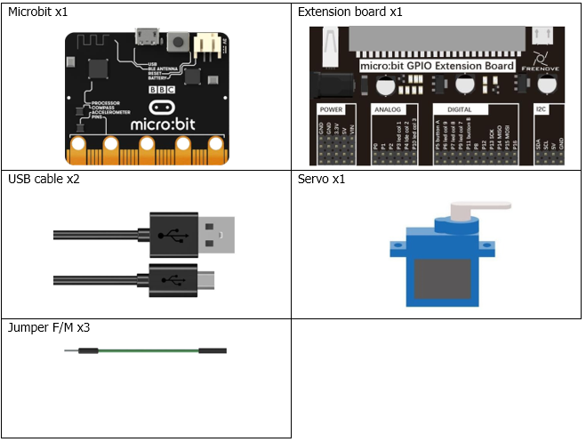
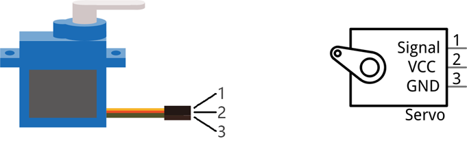
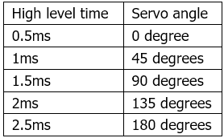
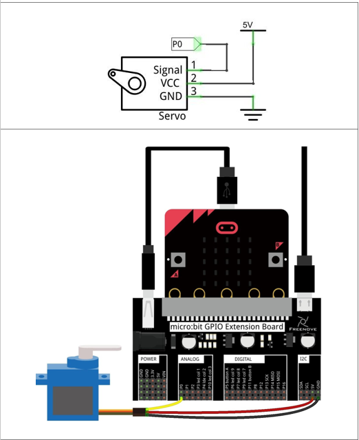

# Capítulo 22 - Servo
## Descripción del proyecto 22.1: Servo
En este proyecto, utilizaremos un servo.

### Hardware necesario
<p style="text-align: center;">
    
</p>

### Conociendo los componentes
#### Servo
Un servo es un dispositivo compacto que consta de un motor de corriente continua, un conjunto de engranajes reductores para proporcionar par, un sensor y una placa de control. La mayoría de los servos solo tienen un rango de movimiento de 180 grados a través de su «cuerno». Los servos pueden generar un par mayor que un simple motor de corriente continua por sí solo y se utilizan ampliamente para controlar el movimiento en maquetas de coches, aviones, robots, etc. Los servos tienen tres cables que suelen terminar en un conector macho o hembra de tres pines. Dos cables son para la alimentación eléctrica: positivo (2-VCC, cable rojo), negativo (3-GND, cable marrón) y la línea de señal (1-Signal, cable naranja), tal y como se muestra en el servo incluido en tu kit.


<p style="text-align: center;">
    
</p>

Utilizaremos una señal PWM de 50 Hz con un ciclo de trabajo dentro de un rango determinado para accionar el servo. La duración de 0,5 ms a
2,5 ms del nivel alto de un ciclo PWM se corresponde linealmente con un ángulo del servo de 0 grados a 180 grados. A continuación se indican algunos de los valores correspondientes:

<p style="text-align: center;">
    
</p>

Como se puede observar en la tabla anterior, el servo gira de 0 a 180 grados, si la anchura de pulso correspondiente es de 0,5 a 2,5 ms. A continuación, se escribe el valor de tensión analógica en el pin del micro:bit, que oscila entre 200 y 1200.

### Esquema de conexión
#### Diagrama esquemático
<p style="text-align: center;">
    
</p>


### Código fuente
> Pin P0 para la señal PWM del servo (cable naranja).

``` rust
{{#include src/main.rs}}
```

``` shell
cargo run
```

#### Explicación del código
Define funciones de mapeo para convertir valores de un rango en valores de otro rango.

``` rust
map(value,fromLow,fromHigh,toLow,toHigh)
```

Fijamos el intervalo de la señal PWM en 50Hz estableciendo el preescalador y la máxima frecuencia. A continuación, en un bucle "for", convierte el valor del rango 0º-180º al rango 200 a 1200, seguidamente, genera la señal PWM correspondiente para girar el servo.

## Descripción del proyecto 22.2: Potenciómetro y motor
En este proyecto, utilizaremos un potenciometro para controlar la posición del servo.

### Hardware necesario
<p style="text-align: center;">
    
</p>

### Esquema de conexión
#### Diagrama esquemático
<p style="text-align: center;">
    
</p>


### Código fuente
> Usamos el pin P1 para la señal PWM del servo (cable naranja) y el pin P0 para leer el valor del potenciómetro.

``` rust
{{#include examples/servo.rs}}
```

``` shell
cargo run --example servo
```

#### Explicación del código
Siguiendo la base del ejemplo 22.1, añadimos el potenciómetro para controlar la posición del servo (Capítulo 14). El valor del potenciómetro se lee y se mapea al rango de 0 a 180 grados, que luego se utiliza para generar la señal PWM correspondiente para el servo. El potenciómetro generaba valores entre -1 y 1023, por lo que se recomienda comprobar para establecer el valor correcto en la función `map`.
