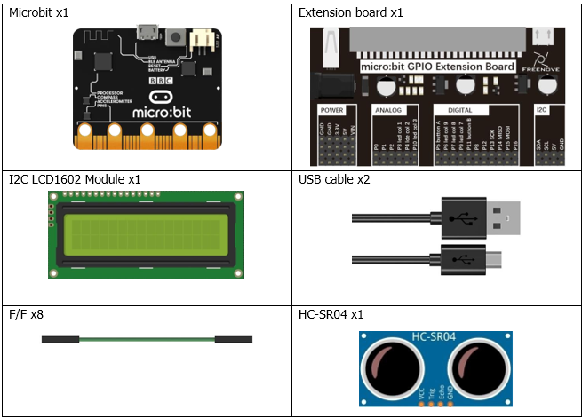
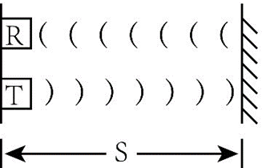
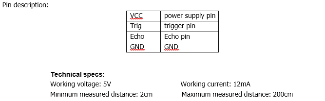
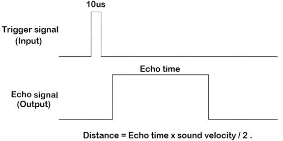
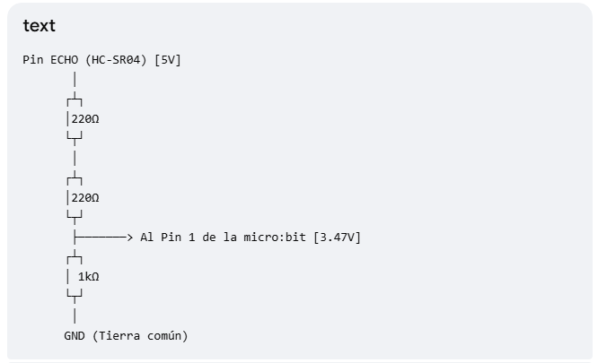
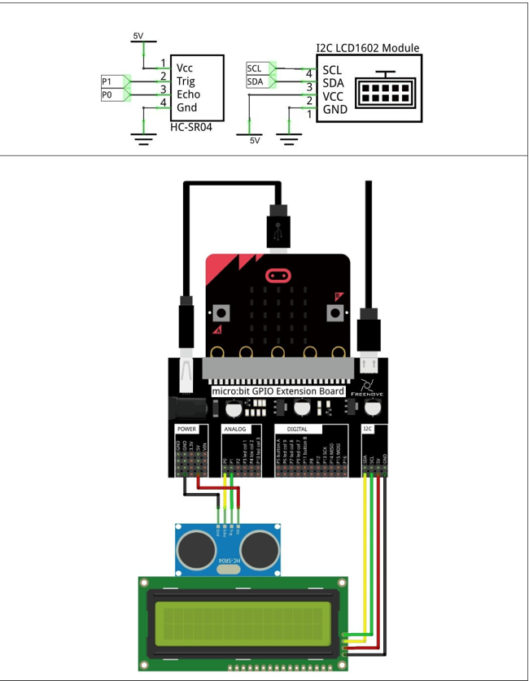

# Capítulo 23 - sensor de distancia
En este capítulo, vamos a conocer un módulo que utiliza ultrasonidos para medir distancias: el HC-SR04.
## Descripción del proyecto 23.1: Sensor de distancia
En este proyecto, utilizamos el módulo ultrasónico HC-SR04 para medir la distancia entre el módulo y el obstáculo que tiene delante y mostrarla en una pantalla LCD.

### Hardware necesario
<p style="text-align: center;">
    
</p>

### Conociendo los componentes
#### Sensor de distancia
El módulo de telemetría ultrasónica se basa en el principio de que las ondas ultrasónicas se reflejan al encontrar cualquier obstáculo. Esto es posible midiendo el intervalo de tiempo que transcurre entre el momento en que se transmite la onda ultrasónica y el momento en que esta se refleja tras encontrar un obstáculo. El recuento del intervalo de tiempo finaliza tras la recepción de la onda ultrasónica, y la diferencia de tiempo (delta) es el tiempo total que tarda la onda ultrasónica en recorrer el trayecto desde su emisión hasta su recepción. Dado que la velocidad del sonido en el aire es una constante, de aproximadamente v = 340 m/s, podemos calcular la distancia entre el módulo de medición de distancias por ultrasonidos y el obstáculo: s = vt/2.

<p style="text-align: center;">
    
</p>

El módulo de medición de distancias por ultrasonidos HC-SR04 integra tanto un transmisor como un receptor de ultrasonidos. El transmisor se utiliza para convertir señales eléctricas (energía eléctrica) en ondas sonoras de alta frecuencia (más allá del umbral auditivo humano) (energía mecánica), mientras que la función del receptor es la contraria. A continuación se muestran la imagen y el esquema del módulo de medición de distancias por ultrasonidos HC-SR04:

<p style="text-align: center;">
    
</p>


<p style="text-align: center;">
    
</p>

Instrucciones de uso: envía un pulso de nivel alto al pin Trig con una duración mínima de 10 µs; el módulo comenzará a transmitir ondas ultrasónicas. Al mismo tiempo, el pin Echo se pone en nivel alto. Cuando el módulo reciba las ondas ultrasónicas reflejadas al chocar con un obstáculo, el pin Echo se pondrá en nivel bajo. La duración del nivel alto en el pin «Echo» es el tiempo total que tarda la onda ultrasónica desde su emisión hasta su recepción, s = vt/2. Este proceso se repite constantemente.

<p style="text-align: center;">
    
</p>

> Si alimentas el sensor con 5V, el pin Echo enviará una señal de 5V que puede dañar tu micro:bit. Debes usar un divisor de tensión (con dos resistencias, por ejemplo, de 1kΩ y 220Ω) en el pin Echo para reducir la señal a ~3.3V antes de conectarla a la placa.

<p style="text-align: center;">
    
</p>

### Esquema de conexión
#### Diagrama esquemático
<p style="text-align: center;">
    
</p>


### Código fuente
> Utilizamos los pines P0 y P1 para los pines Trig y Echo, respectivamente. 

``` rust
{{#include src/main.rs}}
```

``` shell
cargo run
```

#### Explicación del código
Ver conociendo los compenentes más arriba. Se implementa el procedimiento de Lectura y se calcula la distancia en centímetros, según la fórmula s = vt/2, donde v = 340 m/s y t es el tiempo que tarda la onda ultrasónica en ir y volver. La distancia se muestra en la pantalla LCD.

